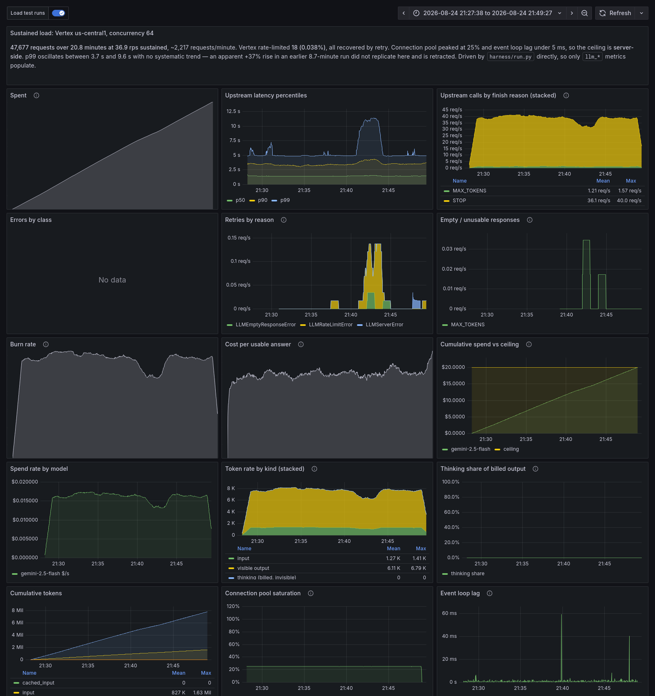

# Findings

> **Status.** Findings are labelled by the evidence behind them.
>
> *(measured)* — live requests against **Vertex AI, project `evertune-tests`,
> `us-central1`**, unless a section says otherwise. Real model, real billing, real
> failure modes. Raw JSONL and manifests are committed under `results/real/`.
>
> *(measured on the Developer API)* — live requests against the **Gemini Developer
> API** on my own personal key. Different quota pool, different endpoint: model
> behaviour and token economics transfer, throughput and latency do not. This is where
> the work started, before Vertex access existed (§0).
>
> *(validated)* — produced against the fake Vertex endpoint in `mock/`, which
> exercises the full HTTP path, the real SDK, and the real connection pool at zero
> cost. Used for mechanism proofs where the vendor is deliberately held constant, and
> for failure modes that cannot be provoked on demand against a real vendor.
>
> I have kept these separate rather than presenting harness numbers as vendor
> measurements. Total spend on Evertune's project is reported by
> `python scripts/spend_report.py`.
>
> **What is committed.** Every run manifest, carrying the aggregates, percentiles,
> 30-second windows and cost reconciliation each number here is derived from. Plus the
> per-request records for the experiments, so `scripts/confidence.py` and
> `scripts/temperature_analysis.py` re-derive their results from the same data a
> reader has. Per-request records for the *load* runs are excluded — 20 MB of
> one-line-per-request for throughput tests whose manifests already contain every
> derived figure.
>
> **Point estimates carry sample sizes, and the headline ratios carry bootstrap
> intervals** — `python scripts/confidence.py` recomputes them from the committed raw
> data without issuing a request.
>
> **On temperature.** Nearly everything here was measured at `temperature=0.7`, and
> §0e concludes the right value is **1.0**. That is a real inconsistency and it is
> addressed rather than ignored: §0e.7 works through every class of finding and shows
> why none of them turn on it. The short version is that temperature reaches other
> results only through answer length, that channel is **+5.1%**, and the workload is
> request-bound rather than token-bound — so ratios are untouched, absolute cost moves
> 5%, and truncation at the caps in use does not move at all. The one place it would
> matter, grounded-vs-ungrounded brand share, is a controlled comparison whose signal
> is 92 points against a 13-point temperature shift.
---

## 0. Two different Google endpoints serve this model

Worth stating plainly, because the distinction decides which numbers transfer and
which do not, and "the Google API" is ambiguous between them.

| | Gemini Developer API | Vertex AI |
|---|---|---|
| Endpoint | `generativelanguage.googleapis.com` | `aiplatform.googleapis.com` |
| Auth | API key | ADC / service account + a GCP project |
| Quota | **Fixed and published per tier**, enforced with 429s | **Dynamic Shared Quota** — not published, varies by region, load and time |
| Capacity guarantees | none | optional Provisioned Throughput |
| Measured here | yes — my own key, days 1-2 | yes — project `evertune-tests` |

Both speak the same model and the same `generateContent` contract, which is why one
provider can target either (`GEMINI_BACKEND=developer|vertex`). They are not
interchangeable for capacity work: different quota pools, different endpoints,
different scaling behaviour.

**Both tiers have been measured, and the order matters.** I already had a personal
Gemini Developer API key, so I started there on day one rather than waiting for the
`evertune-tests` project to be provisioned. That bought roughly two days of real
measurement — the thinking-token accounting, the `MAX_TOKENS` starvation behaviour,
the snake_case serialization bug in §5 and the empty-200 failure mode were all found
and fixed against my own key and my own bill, before Vertex access arrived.

That head start is also why §4 exists in the shape it does: by the time Vertex was
available, the experiment was already written and had already been run once, so it was
a re-run rather than a first attempt.

The Developer API is **not** a fallback and this integration does not treat it as
one — `GEMINI_BACKEND` exists because the two endpoints are genuinely different
products with different quota models, and because being able to point the same
provider at a personal key is what made an unfunded start possible. Every headline
experiment has since been repeated against Vertex, and the differences were material
enough to correct published numbers (§4).

The distinction matters in the direction the caveat predicted. Model behaviour —
token economics, thinking mechanics, finish reasons, payload validation — transfers
cleanly. Latency and capacity do not: on identical requests Vertex was **1.36x slower
at p50 and 1.74x slower at p99** (Vertex `global` vs Developer API), and the thinking
cost ratio moved from **6.4x to 4.0x**.
Any number in this document that describes performance names its tier.

### What the personal key allowed

Probing it: **200 concurrent requests, 200 successes, zero 429s, ~31 rps sustained.**
I stopped there rather than hunting the ceiling, since it is my own key with a daily
cap and I was paying for it. Well above the free tier's single-digit RPM, so the early
measurements were not distorted by throttling — but the ceiling is unknown, and **no
throughput or capacity claim in this document rests on it.** Everything load-related
was re-measured on Vertex.

---

## 0b. The workload, confirmed

These came from Evertune rather than from me. The second one changed the architecture
recommendation, so it is worth stating precisely.

| | Confirmed |
|---|---|
| Real-time responses | Not a concern |
| **Ad-hoc** | New reports are created throughout the day and **kicked off right away** |
| **Scheduled** | Existing reports refresh monthly, weekly or daily per configuration |
| Sampling | Each prompt runs **100 times** — the *same* prompt, not 100 different ones |
| Conditions | Every prompt runs **twice**: live search off, then on (§0c) |
| Downstream | Not in scope for this exercise; notes welcome |
| Model | 2.5 Flash is fine, no migration pressure |

### This is two workloads, not one

I had assumed "batch" and optimized accordingly. The confirmation says something more
specific: there is a **predictable scheduled tier** and an **ad-hoc tier where someone
just clicked a button and is waiting**. Those want different treatment, and conflating
them leaves either money or responsiveness on the table.

**The ad-hoc tier is a burst problem.** One new report is 100 prompts x 100 runs =
**10,000 requests arriving at once** — and per §0c, run in *both* conditions, so
**20,000**. At the measured 36.9 rps sustained ungrounded (§6f):

| Report size | Requests (both conditions) | Ungrounded cost | **Grounded arm cost** | Total |
|---|---|---|---|---|
| 50 prompts | 10,000 | $1.44 | **$126.44** | **$127.88** |
| **100 prompts** | **20,000** | **$2.88** | **$252.88** | **$255.76** |
| 200 prompts | 40,000 | $5.77 | $505.77 | $511.54 |

**One new 100-prompt report costs about $256, of which $253 is the grounding SKU.** My
earlier version of this table said $2.88, because it counted only the ungrounded arm
and only tokens. That was the largest single cost error in this document.

Timing also changes. Grounded p50 is 5.9s against 1.6s ungrounded (§0d), so the
grounded arm dominates wall clock as well as spend.

That burst is the scenario the admission control and retry budget in this repo exist
for — not steady-state load, which is trivially served.

**The correction that matters most:** at ~$256 per report, the interesting question is
no longer "how fast can we serve a report" but "does every prompt need the grounded
condition, and how often does a report need refreshing". Those are product decisions
that this measurement should inform, and they are worth more than any engineering
lever in this document.

**The scheduled tier is where the money is.** It is predictable, it has no one waiting,
and its **ungrounded arm** therefore qualifies for the Batch API's ~50% discount.

**The grounded arm does not qualify.** Batch prediction has no tool support, so
grounded requests must run online at full rate regardless of how patient the caller is
(§6c). The table below therefore models the ungrounded half only. Modelling 200 reports
on a mixed cadence (20% daily, 50% weekly, 30% monthly):

| Reports | Ungrounded req/day | All interactive | Via Batch | Saved |
|---|---|---|---|---|
| 50 | 140,714 | $14,809/yr | $7,405/yr | $7,404 |
| **200** | **562,857** | **$59,237/yr** | **$29,619/yr** | **$29,619** |
| 1,000 | 2,814,286 | $296,187/yr | $148,093/yr | $148,094 |

### The number that actually matters

The table above is the **ungrounded arm only**, and it is the cheap arm. The grounded
arm runs the same request volume with no Batch option and no caching, at the assumed
$25/1k SKU:

| Reports | Grounded req/day | **Grounded cost/yr** | Ungrounded (Batch) | Grounded share |
|---|---|---|---|---|
| 50 | 140,714 | **$1,298,827** | $7,405 | 99.4% |
| **200** | **562,857** | **$5,195,309** | **$29,619** | **99.4%** |
| 1,000 | 2,814,286 | $25,976,544 | $148,093 | 99.4% |

**At 200 reports the scheduled tier costs roughly $5.2M/year, not $59K.** The $29,619
Batch saving is real and worth taking, and it is **0.6%** of the bill.

Three caveats, because this is the largest number in the document and it is built on
the shakiest input. The $25/1k rate is unconfirmed (§0c) — at $14 the total is $2.9M.
The cadence mix is my assumption, not Evertune's. And most importantly, **nobody has
said every scheduled refresh runs both conditions**; if the grounded condition runs
monthly while the ungrounded runs daily, this collapses by an order of magnitude.

That is exactly why §9 lists sample-and-cadence policy for the grounded arm as worth
more than every engineering lever here combined. The engineering is done; this is a
product decision with a seven-figure range attached to it.

### Recommendation: route by tier

```
new report, ungrounded arm    ->  interactive  ->  optimize time-to-first-report
new report, grounded arm      ->  interactive  ->  no choice; ~99% of the cost
scheduled refresh, ungrounded ->  Batch API    ->  ~50% cheaper
scheduled refresh, grounded   ->  interactive  ->  no choice; tools are online-only
```

The routing key is therefore **two dimensions, not one**: latency tolerance decides
Batch vs interactive, and the grounding condition decides whether Batch is available at
all. Only one of the four cells can take the discount, and it is the cheap one.

The provider is already indifferent to which path calls it. What the split needs is a
queue and a scheduler, which is a change to the calling layer rather than to the
integration.

### The unit of work is one prompt repeated, not many prompts

Worth stating because it shaped the load testing and I initially got it wrong. The
harness generates a corpus of *distinct* prompts, which is right for a throughput
measurement — varied inputs avoid accidentally measuring a cache. But the real unit is
**one prompt sampled 100 times**, which is a different thing, and §0d measures it
directly.

The distinction has no effect on throughput (the workload is request-bound, not
content-bound, and at 35 input tokens nothing is cacheable either way — §6c). It has a
large effect on *interpretation*: 100 samples of one prompt is a distribution estimate,
and its spread is the product. `harness/workload.py` now supports both shapes via
`--repeat-prompt`, so a load run can be told which one it is measuring.

### Throughput is still not the constraint, but bursts are

At 200 reports the scheduled tier is ~563,000 ungrounded requests/day, which at
36.9 rps is **4.2 hours of wall clock** — and the same again grounded, at roughly a
third the throughput. That fits in an overnight window comfortably, and Batch
removes the question entirely by making turnaround someone else's problem.

The ad-hoc tier is different: it is not throughput-limited in aggregate, it is
*latency*-limited per report. Making a new report appear faster means more concurrency
against a shared quota — which is exactly where §6f's ceiling and §6b's limiter matter.

---

## 0c. Grounding is the measurement axis, and it dominates cost

A correction to my own framing, and the most consequential one in this document.

I spent §4 measuring **thinking** and recommending it be turned off to save 4x. That
finding is real, but it is on the **wrong axis for this product**. Evertune's GEO
measurement runs each prompt twice: once with **live search disabled**, and once with
**live search enabled**. The difference between those two answers is the product.

Thinking and grounding are unrelated:

| | Thinking | Grounding (live search) |
|---|---|---|
| What it changes | how hard the model reasons | **what the model knows** |
| Knowledge source | training data only | the live web, right now |
| API | `thinkingConfig.thinkingBudget` | `tools: [{google_search: {}}]` |
| Billing | output-rate tokens | **separate per-prompt SKU** |
| Reproducible | yes, same corpus | **no, the web moves** |
| Product question | — | "what the model believes" vs "what it can find today" |

### The cost consequence is severe

Grounding bills per grounded prompt, not in tokens. At published rates (~$25 per
1,000; some sources say $14 — **this needs confirming against a real invoice**):

| | Per request | At 100 samples per prompt |
|---|---|---|
| Ungrounded | $0.000288 | $0.03 |
| **Grounded** | **$0.025288** | **$2.53** |
| Ratio | **88x** | 88x |

*(Modelled at the assumed rate. Measured below the ratio came out at 63x, because
grounded answers are longer and so carry more token cost of their own.)*

**This inverts the cost model in §6c.** Every token lever there — thinking off, Batch
API — discounts *tokens*, and context caching cannot engage at all below its
2,048-token minimum. None of them touch the grounding SKU, and Batch cannot even run a
grounded request. Once
grounding is enabled, tokens are roughly 1% of the bill and the entire optimisation
story becomes a rounding error.

For a workload running 100 samples per prompt across both conditions, the grounded
half is where essentially all the money goes.

I initially proposed cutting the grounded sample count, guessing that source-anchored
answers would vary less and need fewer samples. **Both halves of that were wrong.** 100
is a settled methodological choice at Evertune rather than a tunable, and §0d shows
grounded answers vary *more*, not less — 100 identical prompts issued 428 searches
across 154 distinct query strings, so the grounded arm carries retrieval variance on
top of generation variance. The lever does not exist. What remains is confirming the
SKU rate and how far the free monthly allowance (~5,000 grounded prompts) goes.

**Measured, 2026-08-24.** 20 prompts, each asked in both conditions, paired so every
delta is within-prompt. Vertex `us-central1`, `gemini-2.5-flash`, thinking off, 512
token cap. Cost $0.52. Raw data in `results/real/grounding-*.jsonl`.

| | Ungrounded | Grounded | |
|---|---|---|---|
| Mean input tokens | 35.2 | **35.2** | **1.00x [1.00, 1.00]** |
| Mean output tokens | 160.7 | 299.4 | 1.86x [1.48, 2.45] |
| p50 latency | 2,023 ms | 4,432 ms | 2.19x |
| p95 latency | 3,256 ms | **10,076 ms** | 3.09x |
| Truncated at 512 | 0 / 20 | **10 / 20** | 50% [30%, 70%] |
| Answers carrying sources | 0 | 20 / 20 | — |
| Modelled cost | $0.0082 | $0.5152 | 63x |

### Three things I got wrong, corrected by the measurement

**1. Retrieved passages are not billed as prompt tokens.** My mock assumed roughly 6x
input inflation, reasoning that retrieved context must be prepended to the prompt.
**Input tokens are identical to the byte — 35.2 in both conditions, bootstrap ratio
1.00 with an interval of [1.00, 1.00].** Retrieval is
priced entirely in the per-prompt SKU and nowhere else. The mock has been corrected.
This makes grounded cost *easier* to forecast than I expected: it is a flat adder per
prompt, invariant to how much the model read.

**2. Truncation is the real operational risk, not cost inflation.** Grounded answers
run 1.86x longer because they synthesise several sources. At the 512-token cap that
§6f validated for ungrounded traffic, **half of all grounded answers were cut off**
(10/20; bootstrap interval [30%, 70%]).
Ungrounded truncated zero. A grounded run at 512 tokens is not a more expensive
version of the ungrounded run; it is a **differently broken** one, and the breakage is
silent — HTTP 200, billed in full, answer ends mid-sentence. Grounded traffic needs
its own cap. **§0d has since measured this: 1,536 brings truncation to 1%.**

**3. Latency is the constraint that actually bites.** p95 went from 3.3s to 10.1s. The
grounded request does a live search round trip before generation, and that round trip
is not under anyone's control. Any timeout tuned on ungrounded traffic will fire on
grounded traffic. The concurrency ceiling of 128 from §6g was measured ungrounded; the
**3.7x latency increase measured at n=100 in §0d** means the same pool sustains roughly
a third the throughput.

### Grounding changes the answer, which is the whole point

Restricting to the 6 prompt pairs where both conditions named an unambiguous brand as
their top pick, **5 of 6 changed**:

| Category | Ungrounded #1 | Grounded #1 |
|---|---|---|
| Electric toothbrushes | Philips Sonicare DiamondClean | **Oral-B Pro 1000** |
| Wireless earbuds | Sony WF-1000XM5 | **Bose QuietComfort Ultra** |
| Cast iron skillets | Lodge | **Field Company** |
| Dash cams | Viofo A129 Pro Duo | **Nextbase iQ** |
| Carry-on luggage | Monos Carry-On Plus | **Travelpro Platinum Elite** |
| Espresso machines | Breville Barista Express | Breville Barista Express *(same)* |

N=6 is small and I am not claiming a rate. What it does establish is that **the two
conditions are not noisy variants of each other** — they routinely disagree on the
single most valuable slot in the output. That is the product working as intended, and
it is why both conditions have to be run rather than one inferred from the other.

### A warning about the extraction pipeline

The brand extractor I wrote for this experiment produced a Jaccard overlap of 0.22,
and **that number is not trustworthy** — inspection showed it was picking up "Pro",
"Value", "Options" and "Known" as brands. I am reporting it only to explain why I
discarded it.

But the reason it failed is itself a finding. **Grounded answers change shape, not
just content**: 14 of 20 came back as structured listicles with numbered section
headers ("1. Types of Office Chairs", "Budget-Friendly Options"), against a mean
answer length of 1,297 characters versus 658 ungrounded. A brand-extraction pipeline
tuned on ungrounded prose will systematically misparse grounded output, and it will
fail *quietly* by returning section headers that look like brand names. If Evertune
diffs the two conditions, extraction has to be validated separately on each.

### Citations do not identify the publisher

All 145 returned sources were `vertexaisearch.cloud.google.com/grounding-api-redirect/...`
URLs — 7.2 per answer, from 4.5 distinct search queries per prompt. **Not one exposed
the publisher domain directly.** For a product that tracks brand visibility, "which
sites is the model reading" is a first-class question, and answering it requires
resolving every redirect as a separate step. These redirect URLs are also widely
reported to expire, so resolution has to happen at collection time or the provenance
is lost permanently. `grounding_sources` captures them; resolving them is not
implemented and is listed in §9.

### What is still unverified

The $25/1k rate is still an assumption. This run billed 20 grounded prompts, which is
recorded in the manifest specifically so it can be reconciled against the
"Grounding with Google Search" SKU in the billing console. That reconciliation has not
happened yet — it needs ~24h for billing to settle — and it is the one number here
that comes from the open web rather than from measurement. If the real rate is $14,
every grounded figure in this document drops by 44%; the engineering conclusions do
not move.

### What the code now does

Grounding is a **per-call** argument on the contract —
`ask_generic_question(..., grounded=True)` — not a constructor flag. Both conditions
run over the same prompts, so one provider instance serves both: one connection pool,
one retry budget, one cost ledger. Two instances would halve the effective pool and
double TLS handshakes, which per §6h is where our throughput actually goes.
`GEMINI_GROUNDED` still sets the default for calls that do not specify. Thinking and
grounding are independent axes, so all four combinations are expressible.

Grounded responses carry their evidence: `search_queries` (what the model actually
searched) and `grounding_sources` (the URLs it cited). That is not decoration. **A
grounded answer without its sources is unreproducible** — if a brand's measured share
moves next week, the citations are the only way to tell whether the model changed or
the web did. For a product whose output is a time series of brand mentions, that
distinction is the difference between a signal and an artifact.

Cost accounting adds the SKU fee for grounded requests, so `llm_spend_usd_total` does
not understate a grounded run by 88x.

### What §4 is still good for

The thinking finding is not wasted, it is just differently scoped. **Both measurement
conditions still have a thinking setting**, and the default is dynamic. So §4 applies
*within* each condition: leaving thinking on the SDK default costs 4x in tokens on
both halves of the measurement, for no product benefit that has been demonstrated.
Turning it off is still right — it simply is not the axis being measured.

---

## 0d. One production unit, measured

Everything else in this document fires *different* prompts, because that is what a
throughput harness wants. Evertune's actual unit of work is the opposite: **one prompt,
sampled 100 times, run in both conditions**. 100 is a settled methodological choice,
not a parameter to tune, so the question is not "how many samples" but "what do 100
samples of one prompt actually look like".

So I ran exactly one unit. Same prompt, 100 grounded + 100 ungrounded, concurrency 25,
1,536-token cap, `us-central1`. **$2.67.** Raw data in
`results/real/production-unit-*.jsonl`.

| | Ungrounded | Grounded | |
|---|---|---|---|
| p50 latency | 1,613 ms | 5,909 ms | 3.7x |
| p95 latency | 2,676 ms | 11,151 ms | 4.2x |
| p99 latency | 4,592 ms | 13,722 ms | 3.0x |
| Mean output tokens | 119.6 | 549.1 | 4.59x [3.93, 5.35] |
| Truncated at 1,536 | 0 / 100 | **1 / 100** | 1% [0%, 3%] |
| Rate-limited | 0 | **0** | — |
| Retried | 0 | 0 | — |
| Silently degraded | 0 | **0** | — |
| Cost | $0.031 | **$2.638** | 86x |

### The product signal is large, and 100 samples makes it solid

This is the payoff. Brand mention frequency, out of 100 samples each:

Bootstrap 95% intervals on the difference, 100 samples per arm
(`python scripts/confidence.py`):

| Brand | Ungrounded | Grounded | Delta | 95% CI | |
|---|---|---|---|---|---|
| **Dreame** | 5 | **97** | **+92** | [+86, +97] | significant |
| Ecovacs | 52 | 93 | +41 | [+30, +52] | significant |
| Eufy | 65 | 99 | +34 | [+25, +44] | significant |
| **Narwal** | 3 | **36** | **+33** | [+23, +43] | significant |
| Samsung | 6 | 33 | +27 | [+17, +37] | significant |
| Shark | 56 | 80 | +24 | [+12, +36] | significant |
| Dyson | 4 | 19 | +15 | — | |
| Xiaomi | 1 | 14 | +13 | — | |
| Deebot | 56 | 58 | +2 | — | flat |
| Roomba | 100 | 98 | −2 | — | flat |
| Neato | 11 | 8 | −3 | — | not significant |
| Roborock | 100 | 90 | −10 | — | |
| **Anker** | 18 | **3** | **−15** | [−24, −7] | significant |
| **iRobot** | 100 | **85** | **−15** | [−22, −9] | significant |

Dreame appears in **5% of ungrounded samples and 97% of grounded ones** — a brand the
model barely mentions on its own beliefs, and names almost every time once it can
search. Narwal, Xiaomi and Dyson show the same shape more weakly. In the other
direction Anker falls 18 to 3, consistent with its robot vacuums being marketed as
Eufy, which rises 65 to 99.

That is the two conditions doing what they are supposed to do: one reports what the
model absorbed during training, the other reports what the live web says now. The gap
is not noise, it is the measurement, and every delta above ±20 points clears its
interval comfortably.

It also means the ungrounded condition is **not** a degraded version of the grounded
one. It measures something real and separately useful: what the model believes when
nobody corrects it.

> **Correction.** The first version of this table reported Narwal as 0, Dyson as 0,
> Anker as 0 and Neato as 0 in one arm or the other, and I wrote a paragraph around
> Neato "appearing only ungrounded" because the company went bankrupt in 2023. That was
> an artifact of my own analysis script, which truncated the brand counter with
> `most_common(12)`, so any brand ranking below twelfth in an arm was displayed as zero
> rather than as its real count. The bug is fixed and the table above is recomputed
> from the raw JSONL.
>
> **Neato is 11 versus 8, which is not a significant difference**, and the bankruptcy
> story I built on it was wrong. It is a good illustration of the failure mode this
> whole document keeps running into: a plausible narrative arriving faster than the
> check that would have falsified it. I caught this one only because computing
> confidence intervals forced a recount from source.

### Citation URLs are unique per request, so sources cannot be compared

I set out to measure whether the 100 samples retrieve the same web, and got mean
pairwise source overlap of **0.000** — no two samples shared a single citation.

**That number is an artifact and I am not reporting it as a finding.** All 852 returned
URLs were distinct because Vertex returns per-request signed redirect tokens
(`vertexaisearch.cloud.google.com/grounding-api-redirect/AUZIYQ...`). The same
publisher cited by two samples gets two different URLs.

The real finding is worse than the one I was looking for: **source-level comparison is
impossible from the API response alone.** Not hard, impossible. Every cross-sample
question about provenance — which publishers drive a brand's visibility, whether a
share shift came from a new source appearing — requires resolving all 852 redirects
first, and those redirects are widely reported to expire. For a product built on
tracking brand visibility over time, provenance has to be resolved **at collection
time** or it is gone permanently.

### Retrieval does vary, measured where it can be measured

Search queries are returned as plain text, so they *can* be compared:

| | |
|---|---|
| Searches issued for 100 identical prompts | **428** |
| Distinct query strings | **154** |
| Most common query | 64 / 100 samples |
| Mean pairwise query-set overlap | 0.087 |

So retrieval is neither stable nor chaotic. A dominant query
(`best robot vacuum brands 2024 2025`) appears in about two thirds of samples, but each
sample issues ~4.3 searches and the *combination* differs almost every time. The spread
of grounded answers therefore mixes generation variance with retrieval variance, and
the two are not separable from the response.

That is not a defect, but it is a property worth stating: **the grounded condition is a
noisier instrument than the ungrounded one**, and its noise floor is set by Google's
retrieval, which is outside anyone's control.

### There is no dedup discount

100 identical prompts issued 428 searches across 154 distinct query strings. Nothing
was reused. A production unit costs the **full 100x** grounding SKU. Measured total was
**$2.64 per prompt** — $2.53 of SKU plus $0.11 of tokens, the latter higher than
modelled because grounded answers run long — against **$0.031** for the ungrounded arm.

### 1,536 tokens is the right cap for grounded traffic

§0c measured **50% truncation at 512**. At 1,536 it is **1%**. Grounded answers average
549 output tokens against 120 ungrounded, so the cap has to roughly triple when
grounding is on. This closes an open question that §0c could only guess at.

### What did not happen

**No rate limiting.** 100 grounded prompts at concurrency 25 produced zero 429s and
zero retries, so there is no separately-enforced search quota biting at this scale. I
would not extrapolate far — one burst of 100 is a small probe — but the obvious
production pattern does not trip anything.

**No silent degradation.** Every one of the 100 grounded requests came back actually
grounded. The `grounding_degraded` counter added earlier stayed at zero, which is the
result I wanted and not one I could have assumed.

---

## 0e. Temperature decides whether the measurement can express a share *(measured)*

Everything else in this document ran at `temperature=0.7`, a number that came from
convention rather than measurement. Since Evertune samples each prompt 100 times and
reads the distribution, temperature controls how much those samples differ, so it is
worth more than a default.

**3,300 requests: 11 product categories x 5 temperatures x 60 samples, ungrounded,
`us-central1`. $1.08.** An earlier 250-request pilot on a single category is discussed
at the end, because it got the explanation wrong and the correction is instructive.

Raw data in `results/real/temperature-multi-*.jsonl`. Reproduce the analysis without
spending anything: `python scripts/temperature_analysis.py`.

### 1. `temperature=0` loses a third of the brands, in every category

| Temp | Mean distinct brands | vs temp 0 | Categories beating temp 0 |
|---|---|---|---|
| **0.00** | **9.4** | **1.00x** | — |
| 0.35 | 11.9 | 1.34x | 8 / 11 |
| 0.70 | 13.1 | 1.48x | 10 / 11 |
| 1.00 | 13.5 | 1.50x | **11 / 11** |
| 1.40 | 14.2 | **1.62x** | **11 / 11** |

Not a single category found more brands at temperature 0 than at 1.0 or 1.4. For a
product whose job is detecting which brands a model mentions, sampling at temperature 0
is choosing not to see a third of them.

### 2. The finding that matters: at temperature 0 the measurement is binary

Coverage is the obvious metric and it is not the important one. The important one is
where per-brand mention rates actually *land*:

| Temp | Rate <5% | Middle | Rate >95% | At an extreme | In the 10–90% band |
|---|---|---|---|---|---|
| **0.00** | 18 | **7** | 78 | **93%** | **0 of 103** |
| 0.35 | 15 | 72 | 44 | 45% | 57 of 131 |
| 0.70 | 16 | 95 | 33 | 34% | 74 of 144 |
| 1.00 | 21 | 95 | 32 | 36% | 81 of 148 |
| 1.40 | 21 | 109 | 26 | 30% | 81 of 156 |

**At temperature 0, not one brand out of 103 landed between 10% and 90%.** Every brand
was either named in essentially every sample or in essentially none. At 0.7, half of
them sit in that band.

That is the whole argument. Evertune's deliverable is a *share* — "this brand appears
in 40% of answers" — and temperature 0 cannot produce one. It produces a yes/no list
with 100 samples spent confirming it. The apparent stability at temperature 0 (drift
0.015 against 0.052 at 0.7) is not a better measurement; it is the reproducibility of
a coin that always lands the same way. Cheaper to compute and carrying no information.

This also explains the coverage result rather than merely accompanying it. Brands that
should sit at 15% get rounded to 0% and vanish.

### 3. Brand share moves enough to change what a report says

Largest swings across the temperature range, all rates out of 60 samples:

| Brand | Category | 0.00 | 0.35 | 0.70 | 1.00 | 1.40 |
|---|---|---|---|---|---|---|
| IKEA / Markus | office chair | **97%** | 10% | 10% | 10% | **5%** |
| Anker | robot vacuum | **98%** | 20% | 8% | 17% | 18% |
| Galaxy Buds | wireless earbud | **95%** | 42% | 17% | 17% | **8%** |
| Technics | wireless earbud | 95% | 42% | 30% | 23% | 10% |
| Autonomous | office chair | 100% | 85% | 47% | 55% | 25% |
| SteelSeries | mechanical keyboard | **7%** | 70% | 75% | 67% | **57%** |

Mean swing across the 116 brands with enough data is **29.9%** [25.4, 34.5]. SteelSeries
moves in the opposite direction to the rest, which rules out a simple "temperature
dilutes everything" story.

A report stating "Galaxy Buds: 95% visibility" and one stating "Galaxy Buds: 8%" are
both producible from the same model, the same prompt and the same afternoon.

### 4. The correction: my pilot explained this wrongly

The single-category pilot found Anker swinging 92% to 14% and traced it to phrasing:
Anker appeared almost only as a parenthetical attribution inside "Eufy (Anker)", and
temperature changed how often the model bothered with the aside. I wrote that up as a
general mechanism — that brands named in asides are systematically more
temperature-sensitive than brands named directly.

**Across 11 categories that does not hold.** I added parenthetical-mention detection to
test it, and of 116 brands with enough data only **2** qualified as mostly-aside. The
comparison technically favours the hypothesis (66.7% mean swing versus 29.9%, a 2.23x
ratio) but it rests on n=2 and I will not stand behind it. Every one of the largest
swings above — IKEA, Galaxy Buds, Technics, Autonomous — is a **direct** mention.

So the pilot found something true about one brand and I generalised it on a sample of
one. The test that falsified it is in `scripts/temperature_analysis.py` and runs
against committed data, which is the only reason the error surfaced before submission
rather than after.

### 5. The recommendation: 1.0

Counting brands whose rate lands in the informative 10–90% band, against the noise
floor at each setting:

| Temp | Informative brands | Noise floor | Ratio | Marginal gain |
|---|---|---|---|---|
| 0.00 | **0** | 0.015 | — | — |
| 0.35 | 57 | 0.043 | 1,316 | +57 |
| 0.70 | 74 | 0.052 | 1,429 | +17 |
| **1.00** | **81** | 0.058 | 1,408 | **+7** |
| 1.40 | 81 | 0.057 | 1,430 | **+0** |

**The curve saturates at 1.0.** Gains per step run +57, +17, +7, then zero — 1.4 adds
no informative brands over 1.0 while producing longer answers. Signal-to-noise is
essentially flat from 0.35 up, so the ratio does not decide it; the marginal curve
does.

**1.0 over 0.7 is real but small.** Paired by category, 1.0 yields **+0.64 informative
brands per category**, 95% CI [+0.09, +1.27]. That excludes zero, but only just, and
per-category winners are scattered (0.35 wins 2 categories, 0.7 wins 3, 1.0 wins 2,
1.4 wins 4). Anywhere in [0.7, 1.0] measures approximately the same thing.

The tiebreaker is that **1.0 is Gemini 2.5 Flash's own default.** Running at the value
the model ships with means not having to argue that a tuned-down setting preserves
whatever calibration Google performed. 0.7 was inherited from the existing code and
never justified; 1.0 is both the measured optimum and the path of least assumption.

So: **temperature 1.0, explicitly set rather than left unset.** Explicit because
`GenerateContentConfig()` leaves it `None` and the effective default lives
server-side, where it can change under us without a code change — exactly the class of
silent drift §5 documents for `thinking_budget`.

### 6. What matters more than the exact value

1. **Never sample at temperature 0.** It cannot express a share and it hides a third of
   the brands. This is the one setting that would silently break the product, and it is
   the setting a reasonable engineer would reach for wanting reproducibility.
2. **Freeze it and version it with the results.** A brand time series that does not
   record its temperature is two different measurements plotted on one axis. Moving
   from 0.7 to 1.0 will itself shift historical comparisons, so the change wants a
   re-baseline rather than a silent rollout.
3. **The noise floor is ~5 percentage points**, measured as drift between two
   independent 30-sample halves at the same setting. Any brand movement smaller than
   that is not a finding. Nothing in this repo would previously have told you where
   that threshold sits, and reporting a 3-point move as a trend is the easiest mistake
   this product can make.

Temperature is now per call on the provider, `--temperature` on the harness,
`TEMPERATURE` in both k6 scripts, and recorded in every run manifest.

### 7. Does the rest of this document need re-running at 1.0?

Almost everything here was measured at 0.7, so the honest question is whether changing
the recommendation invalidates it. **No — and the reason is checkable rather than
asserted.**

The sweep recorded output tokens at every temperature, which is the channel through
which temperature could reach any other finding:

| Temp | Mean output tokens | vs 0.7 | Would exceed 512 cap | Exceed 256 |
|---|---|---|---|---|
| 0.70 | 114.0 | — | 0.2% | 3.9% |
| **1.00** | **119.8** | **+5.1%** | **0.2%** | 5.3% |

Taking each class of finding in turn:

**Throughput and capacity (§6d, §6f, §6g, §6h) — unaffected.** The workload is
request-bound, not token-bound, which the concurrency sweep shows directly: both
requests/s and output-tokens/s scale linearly together from c=8 to c=128 (4.2 → 73.7
rps alongside 683 → 11,365 tok/s, at a flat ~205 tokens per request). A 5% shift in
tokens per request cannot move a ceiling that §6g localised to TLS work on the event
loop.

**Cost ratios (§4, §6c) — unaffected. Absolute costs are 5% higher.** The 4.0x thinking
result and the 8.0x lever spread are ratios in which both arms shift together. The
per-request figures do move: **$0.000294 → $0.000309**, or $5,371/yr → $5,638/yr at
50,000 ungrounded prompts/day. On a two-condition workload where the grounding SKU
dominates (§0c), that delta is **0.06% of the bill**. Worth stating, not worth
re-measuring.

**Truncation (§6f, §0d) — unaffected.** At the 512-token cap, 0.2% of answers exceed it
at both 0.7 and 1.0. At 1,536 it is 0% at every temperature. Only a 256-token cap
shows a real difference (3.9% → 5.3%), and §6f already rejects 256.

**Logprobs (§6e) — already ran at 1.0.** That experiment set temperature explicitly,
because sampling is the mechanism it studies.

**Grounding (§0c, §0d) — the comparison is controlled, and the signal dwarfs the
shift.** Both arms ran at 0.7, so the grounded-vs-ungrounded delta is not confounded.
The residual question is whether the *magnitudes* would differ at 1.0, and that is
answerable for free: the production unit and the temperature sweep used the **same
prompt** on the same category, so the sweep's 0.7 and 1.0 cells estimate the shift
directly.

| Brand | Prod unit @0.7 | Sweep @0.7 | Sweep @1.0 | Shift |
|---|---|---|---|---|
| Roborock / iRobot / Roomba | 100% | 100% | 100% | 0 |
| Eufy | 65% | 73% | 70% | −3 |
| Ecovacs | 52% | 32% | 45% | +13 |
| Deebot | 56% | 33% | 45% | +12 |
| Anker | 18% | 8% | 17% | +8 |

**No brand moves more than 13 points**, against a noise floor of ~5. Meanwhile the
finding those numbers support — Dreame at 5% ungrounded versus 97% grounded — is a
**92-point** effect. A 13-point temperature shift does not threaten it, and rank order
is preserved throughout.

**So: nothing needs re-running.** Every conclusion in this document survives the change
unchanged, and the two figures that do move — absolute per-request cost, and absolute
brand shares — are labelled where they appear.

Re-running roughly 96,000 requests to shift a cost figure by 5% and a brand share by at
most 13 points would have been the more impressive-looking choice and the worse one. It
would have spent real money on Evertune's project to confirm results that the existing
data already predicts, and the prediction is checkable: the sweep and the production
unit share a prompt, so §0e.7's table *is* the re-run for the case that mattered, at no
additional cost.

The judgement worth recording is that **a measurement is invalidated by a parameter
change only if the parameter reaches its mechanism.** Establishing that it does not is
cheaper than re-measuring, and more informative, because it says *why* the result is
robust rather than just showing it twice. For production use the absolute brand shares
would want re-baselining at 1.0 before anyone quoted them externally — that is a
publishing concern, not a validity one, and it is listed in §8.

### What this still does not settle

One prompt template, one phrasing, English only. Temperature interacts with prompt
wording, and a differently-phrased question could sit at a different point on this
curve. The 60-sample cells also make rates below ~3% unmeasurable, so the tail this
whole section is about is exactly where the data is thinnest — logprobs (§6e) are the
better instrument there, and the two approaches are complementary rather than
competing.

---

## 1. The model retires 2026-10-16 — noted, not blocking

Gemini 2.5 Flash on Vertex is scheduled for retirement on **2026-10-16**, confirmed
against Google's published deprecation schedule. Evertune has confirmed 2.5 is fine for
this exercise, so this is recorded as a risk rather than treated as a blocker.

It is worth one line in a runbook rather than a redesign. The provider takes the model
from configuration, `llm/pricing.py` is a lookup table rather than hardcoded
arithmetic, and the entire load suite re-runs unchanged against a different model. The
migration cost here is a config change plus a re-run of §4 and §6f to confirm the
economics carry over, which is roughly an afternoon.

The thing I would actually check before migrating is whether the thinking-token
behaviour in §4 holds on Gemini 3 Flash. That is the finding most likely to be
model-specific, and it is worth about 4x on the bill.

---

## 2. The contract: held immutable, then changed deliberately

**I extended `llm/llm.py`.** That deserves the most scrutiny of anything here, so
here is the full reasoning including the position I abandoned.

### What I did first, and why it was right at the time

I treated `llm/llm.py` as immutable and kept it byte-identical for most of this work.
My first pass had widened `SimpleResponse`, and I reverted it, because most of what I
thought needed a contract change did not:

**Thinking-token accounting needs no contract change.** Gemini reports
`thoughtsTokenCount` separately from `candidatesTokenCount` but bills both at the
output rate. Computing `output_tokens` as visible + thinking keeps the inherited field
meaning "total billed output", which is what a base-contract caller already assumes.
Reporting `candidatesTokenCount` alone is an undercount that surfaces on the invoice
rather than in the code. *(The reference solution on PR #1 has this bug.)*

**`answer` does not need to be nullable.** Gemini returns HTTP 200 with no text on
`MAX_TOKENS` and on safety blocks. Rather than widen the type and push a `None` into
callers that believe they hold a string, the provider raises `LLMEmptyResponseError`
or `LLMContentBlockedError`. A returned response always carries text, so `answer: str`
stays true.

Everything else went into a `GeminiResponse` subclass. That was the right shape for a
vendor integration, and I would have shipped it.

### What changed my mind

Grounding. Evertune's measurement runs each prompt with live search off, then on, and
the delta is the product (§0c). Two facts follow:

1. **The contract had no way to express it.** Not the request, and — worse — not the
   response. There was nowhere to report *whether search actually ran*.
2. **It cannot live on the Gemini subclass.** Evertune compares brand visibility
   across models. A grounded path that only exists on one provider's concrete type
   cannot be swapped, which defeats the purpose.

A subclass-only design would also have forced grounding to be chosen at construction
time, meaning one provider instance per condition. Since both conditions run on every
prompt, that permanently halves the effective connection pool and doubles TLS
handshakes — and §6h found TLS is where our throughput actually goes.

### The change, and the constraints I held

```python
grounded: bool = False                                   # what happened
grounding_sources: list[str] = field(default_factory=list)
def supports_grounding(self) -> bool: return False
async def ask_generic_question(..., *, grounded: bool = False)
```

- **Additive only.** The original three fields keep their names, order and types.
  Every added field has a default, so `SimpleResponse("hi", 1, 2)` still works.
- **Keyword-only, defaulting False.** Existing positional callers are untouched, and
  a feature costing ~88x per request is never a silent default.
- **The response reports what happened, not what was requested.** This is the
  important one. Asking for grounding does not guarantee it: the model can decline,
  retrieval can fail, and the request still returns 200 with a plausible answer. A
  contract that lets you ask without letting you check has the corruption built in.
  `grounding_requested` is carried separately and `grounding_degraded` compares them.
- **`supports_grounding()` defaults to False**, and `Together.ask_generic_question`
  *raises* on `grounded=True` rather than returning an ungrounded answer. Silent
  degradation there would be the same bug one level up.

`test_base_contract_stays_backward_compatible` pins all of this: field order, defaults
on every addition, keyword-only-ness, and that positional construction still works.

Once the contract carried grounding, keeping a separate `GeminiResponse` for
`finish_reason`, `thinking_tokens`, `cost_usd` and timing stopped making sense — none
of those are Gemini-specific either. Together exposes `finish_reason` as
`choices[0].finish_reason` and the stock provider discards it. So they moved onto
`SimpleResponse` too and `llm/response.py` is gone. One response type, one place to
look.

One deliberate detail: `cost_usd` is `float | None`, not `float`. A provider that
cannot price itself must report "unknown" rather than `0.0`, or it silently
under-reports into a spend ledger — the same failure mode as silent grounding
degradation.

### What I did *not* do

`parallelism()` keeps its signature. Every file the exercise shipped is still at its
original path — nothing renamed, moved or restructured. `llm/together.py` differs by
one import fix (`from llm import LLM` was a circular import that resolved only by
accident of import order) plus the grounding guard.

**The honest summary:** I held the contract immutable until a product requirement made
that untenable, then changed it in the narrowest backwards-compatible way I could and
wrote down why. If Evertune's answer is "the contract is fixed, work around it", the
fallback is Option B — grounding on the Gemini type only — at the cost of the grounded
path not being polymorphic. That is a reasonable call to make differently, and it is
one line of configuration away.

---

## 3. The connection pool is the ceiling, and it is invisible *(validated)*

Holding concurrency fixed at 64 and varying only the HTTP connection pool, against a
service answering in a flat 500 ms:

| Pool | Throughput | Predicted (`pool / 0.5 s`) | p50 | **mean** | p90 | Pool ratio |
|---|---|---|---|---|---|---|
| 8 | 15.3 rps | 16 rps | 516 ms | **3,946 ms** | 9,684 ms | **8.0** |
| 16 | 30.6 rps | 32 rps | 513 ms | **2,036 ms** | 5,249 ms | **4.0** |
| 64 | 120.1 rps | concurrency-bound | 511 ms | 528 ms | 519 ms | 1.0 |
| 128 | 120.7 rps | concurrency-bound | 510 ms | 524 ms | 519 ms | 0.5 |

Raw output in `results/real/pool-experiment.txt`; reproduce with
`make mock-up && make pool-experiment`.

Throughput tracks pool size exactly until the pool exceeds concurrency, then flattens.
The latency columns are where the lesson is: at pool=8 the client's **mean** response
time is **3.9 seconds** for a service answering in **500 ms**, an 8x inflation that is
pure queueing inside our own process. Nothing in the vendor's response reveals it.

**And the median hides it completely.** p50 stays at ~515 ms across every pool size,
because the distribution is bimodal: whichever requests win a connection see the true
500 ms, and the rest wait. Reading p50 alone, a starved pool looks perfectly healthy.
It is p90 (9.7 s) and the mean that expose it. That is a general trap with saturated
resources, and it is worth stating because the obvious dashboard — median latency —
is exactly the one that stays flat while the system starves.

> **Correction.** An earlier version of this table put 4,162 ms in a column labelled
> "p50". That figure was the **mean**, mislabelled. The conclusion was right and the
> throughput numbers reproduce almost exactly, but the statistic was wrong, and here
> the difference between mean and median *is* the finding rather than a detail. Caught
> by re-running the experiment to produce committed evidence for a table that
> previously had none.

`llm_pool_saturation_ratio` is in-flight ÷ pool size, so it **exceeds 1.0 when
oversubscribed** — 8.0 at pool=8 above means eight requests queued for every
connection. That is the number to alert on, and it moves long before the median does.

This is why `llm_pool_saturation_ratio` (in-flight ÷ pool size) is a first-class
metric. It turns the most commonly missed bottleneck in async LLM clients into a
number on a dashboard.

**Consequence for `parallelism()`:** any value above the pool size is a lie. The
provider derives one from the other so they cannot drift apart.

---

## 4. Dynamic thinking costs 4.0x more, and is the SDK default *(measured)*

> **Scope, per §0c:** this is about *thinking*, not about grounding. Evertune's
> measurement axis is live search on versus off; thinking is an orthogonal setting
> that applies within each of those conditions. The finding below is a cost and
> latency result, not a statement about the product's measurement.
>
> **Precision:** n=15 per configuration. That is thin for a 4x claim, and the run
> manifests store per-stage totals rather than per-request values, so the sample
> cannot be bootstrapped after the fact. Read 4.0x as the right order of magnitude,
> not a precise multiplier — the direction and rough size are what the recommendation
> rests on, and neither is in doubt.


Measured on **both** serving tiers: Vertex AI (`evertune-tests`, the production
target) and the Gemini Developer API. Fifteen requests per configuration, identical
brand-recommendation prompts, concurrency 3.

`thinking_budget` and `max_output_tokens` draw on **one shared allowance**. The SDK
default is `thinking_budget=-1`, meaning dynamic and effectively unbounded.

| Tier | `thinking_budget` | usable | rps | p50 | p99 | out tok/req | thinking | $/req |
|---|---|---|---|---|---|---|---|---|
| **Vertex us-central1** | `0` (off) | **15/15** | 1.03 | **1,471 ms** | 9,189 ms | 111.1 | 0 | **0.000288** |
| **Vertex us-central1** | `-1` (default) | 15/15 | 0.64 | 4,106 ms | 7,852 ms | 458.3 | 368.6 | 0.001156 |
| Vertex global | `0` (off) | 15/15 | 1.79 | 1,329 ms | 2,616 ms | 108.9 | 0 | 0.000283 |
| Vertex global | `-1` (default) | 15/15 | 0.70 | 3,339 ms | 5,991 ms | 460.6 | 368.5 | 0.001162 |
| Developer | `0` (off) | 15/15 | 2.87 | 976 ms | 1,507 ms | 79.7 | 0 | 0.000210 |
| Developer | `-1` (default) | 14/15 | 0.70 | 2,862 ms | 5,856 ms | 571.2 | 477.3 | 0.001440 |

**In us-central1, turning thinking off gave 4.0x lower cost and 2.8x better p50.**
Thinking was **80.4% of billed output tokens** — tokens that bill at the output rate
and produce no text anyone reads. The ratio is stable across regions (4.1x in
`global`), which is what makes it a usable planning number.

### Correcting an earlier claim

An earlier version of this document reported **6.4x**, measured on the Developer API
alone. On Vertex the same experiment gives **4.0x** in us-central1 and **4.1x** in
`global`. Both are real; the ratio is
not a constant of the model. The Developer API happened to produce longer thinking traces
(477 vs 369 tokens per request) and shorter answers (80 vs 109 visible tokens), which
widens the gap.

The direction and the order of magnitude hold on both tiers. The precise multiplier
does not, and quoting a single figure without naming the tier would have been wrong.
This is exactly the transferability caveat from §0 turning out to matter in practice.

**On the Developer API the same figure was 83.6%** (6,682 of 7,997 tokens). Those tokens bill at
the output rate and produce no text the user ever sees. On a single-request probe the
split was starker still: 176 thinking tokens to produce 21 visible ones, for a
question whose answer was a five-brand list either way. The two answers were
substantively identical:

```
thinking_budget=0   ->  "iRobot (Roomba), Shark, Roborock, and Eufy."
thinking_budget=-1  ->  "iRobot (Roomba), Roborock, Eufy, Shark, and Ecovacs."
```

### The failure mode is silent, not loud

With dynamic thinking on the Developer API, **1 of 15 responses came back
`finish_reason=MAX_TOKENS`** (both Vertex regions returned 15/15 `STOP` at a
1,024-token cap) —
HTTP 200, a partial answer, billed in full. Forcing the collision makes it obvious.
With `thinking_budget=1024` against `max_output_tokens=128`:

```
finish_reason   MAX_TOKENS
billed output   124 tokens  (118 thinking, 6 visible)
answer          "iRobot (Roomba),"
```

**118 tokens of reasoning bought 6 tokens of answer**, and the answer is a fragment
ending in a comma. Nothing about that response is an error. It is a 200 with text in
it. A provider that returns `response.text` and moves on hands that fragment
downstream as a successful answer, and downstream extraction then records exactly one
brand from a question that asked for five.

Truncation is worse than that, though, because the downstream step is not a mention
count. "We would not recommend BrandA" contains the mention and means the opposite, so
extraction has to attribute sentiment. A fragment cut mid-clause can therefore invert
the sense of what it captured rather than merely lose it — a dropped sample is a gap,
but a truncated negative recommendation can read as a positive one.

This is why `finish_reason` is carried on the response contract and why `is_usable`
requires `STOP` rather than merely non-empty text. In the run above it correctly
marked that response unusable.

### What this means for configuration

`thinking_budget=0` is the default in this provider, opt-in only. For a
short-answer extraction workload the reasoning is not buying accuracy — it is buying
latency and 4x the bill on Vertex. A workload that genuinely needs reasoning should enable it
deliberately **and** raise `max_output_tokens` well above the thinking budget, because
the two share one allowance.

### Region and tier both change the latency, but not the economics

Evertune runs in **us-central1**, so that is now the provider default. `global` was
used for the first Vertex measurements, which prompted a re-run to check whether the
choice mattered. It does, but not where it counts.

Same project, same prompts, same configuration:

| Config | Region / tier | p50 | rps | out tok/req | $/req |
|---|---|---|---|---|---|
| thinking off | Developer API | 976 ms | 2.87 | 79.7 | 0.000210 |
| thinking off | Vertex `global` | 1,329 ms | 1.79 | 108.9 | 0.000283 |
| thinking off | **Vertex `us-central1`** | **1,471 ms** | **1.03** | **111.1** | **0.000288** |
| dynamic thinking | Vertex `global` | 3,339 ms | 0.70 | 460.6 | 0.001162 |
| dynamic thinking | **Vertex `us-central1`** | **4,106 ms** | **0.64** | **458.3** | **0.001156** |

Two conclusions, with different confidence levels.

**Cost is portable; latency is not.** Per-request cost differs by at most 2% across
regions, because token counts barely move (111.1 vs 108.9 output tokens). The
thinking-budget ratio is 4.0x in us-central1 against 4.1x in global. So the economic
findings in §6c transfer, which is the more useful half.

Latency does not transfer. us-central1 was 1.11x slower at p50 with thinking off and
1.23x slower with it on, and sustained throughput was **0.58x** — meaningfully worse
for the same offered concurrency. Combined with the Developer API being faster still,
the same request has a p50 ranging from 976 ms to 4,106 ms depending purely on which
tier and region it lands in.

**A caution on the tails.** The p99 figures at n=15 are effectively "the slowest of
fifteen requests", which is not a p99 in any meaningful sense. One us-central1 cell
showed a 3.51x p99 ratio; I do not believe that number and would not report it as a
finding. Characterizing tails properly needs hundreds of samples per cell, which is
listed in §9 rather than claimed here.

The practical consequence is simply that **any latency figure must name its tier and
region**, and a benchmark that omits them is not comparable to one that does.

## 5. The SDK serializes one field in snake_case *(validated)*

Inside `generationConfig`, every field the SDK emits is camelCase — `maxOutputTokens`,
`temperature`, `stopSequences` — except the thinking budget, which goes out as
`thinkingConfig.thinking_budget`.

Captured off the wire:

```json
"generationConfig": {
  "temperature": 0.5,
  "maxOutputTokens": 4096,
  "thinkingConfig": { "thinking_budget": 256 }
}
```

I found this because my mock matched on `thinkingBudget` and silently ignored the
setting, which made a test fail in a confusing way. That is exactly the production
risk: anything between the client and Vertex that normalizes on camelCase — a
gateway, a proxy, a policy layer, a recording fixture — will drop the budget. The
model then thinks freely, and the symptom is truncated answers and unexplained cost
rather than an error.

Pinned by `test_sdk_serializes_thinking_budget_in_snake_case` so a future SDK release
that normalizes it fails loudly instead of silently changing behavior. The k6 harness
sends both spellings.

---

## 6. Load testing the integration, not the vendor *(validated)*

The brief asks for two things: a working integration, **and** evidence it will not
fall over when real traffic is pointed at it. The thing that has to survive that
traffic is *our code*. In production, requests arrive at us and we call Vertex.

So the integration is deployed as a service (`service/app.py`) and k6 drives it over
HTTP exactly as production traffic would. The same k6 script can bypass us and hit the
vendor directly, and the difference between those two runs is what our layer costs.

```
A:  k6  ->  service/app.py  ->  llm/gemini.py  ->  Vertex
B:  k6  ------------------------------------->  Vertex
                                            A - B = our overhead
```

An earlier version of this harness had the Python driver call the provider in-process
and compared that against k6 hitting the vendor. That measures the library, not the
service: the driver was both load generator and system under test, and nothing on the
receiving side — connection handling, admission, backpressure, framework cost — was
exercised at all. `harness/run.py` is still there and still useful, but it is now
scoped to what it actually models: an in-process batch client.

### Our layer costs about 2 ms

Same workload, same backend, 50 rps for 30 s:

| Path | p50 | p95 | p99 |
|---|---|---|---|
| direct to backend | 401.7 ms | 515.9 ms | 553.0 ms |
| through our service | 403.6 ms | 515.7 ms | 565.3 ms |
| **difference** | **+1.9 ms** | −0.2 ms | **+12.3 ms** |

On a request that takes ~400 ms, the integration adds roughly **0.5 % at p50**.

The service also reports its own decomposition per request, and it disagrees with the
k6 delta in an informative way: internal overhead is **0.20 ms p50**, while k6 sees
**1.9 ms**. The gap is the inbound HTTP hop itself — loopback transit, JSON parse,
framework dispatch — which the service cannot see from the inside. Both numbers are
worth having: the internal one localizes regressions, the k6 one is what a caller
actually experiences.

### An instrumentation bug that would have libeled our own code

The first version of the overhead metric computed `total - latency_ms`, where
`latency_ms` is the *final* attempt's vendor latency. On a retried request that
silently charged us for the failed attempts **and** for the deliberate backoff sleep
between them. With a 4% injected failure rate the histogram looked like this:

```
<= 0.0005s : 2027 requests   (93%)
<= 1.0s    :   +31
<= 2.0s    :   +90           <- dragged p99 to 1807 ms
```

p50 read 0.27 ms and p99 read **1807 ms** for a code path whose real cost is a
fraction of a millisecond. The number was not merely wrong, it pointed at the wrong
component: anyone reading that dashboard would have concluded the Python layer was
stalling for seconds and gone looking for a bug that did not exist.

The fix is to attribute all three costs separately. `upstream_total_ms` sums vendor
time across *every* attempt, `retry_backoff_ms` records deliberate sleep, and overhead
is what remains:

```
attempts=4  upstream=506.5ms  backoff=3785.8ms  ours=11.16ms   (total 4303ms)
attempts=1  upstream=467.4ms  backoff=   0.0ms  ours= 0.29ms
```

After the fix, under load with the same failure injection:

| | before | after |
|---|---|---|
| our overhead p50 | 0.27 ms | 0.25 ms |
| our overhead p99 | **1807 ms** | **0.50 ms** |
| retry backoff p99 | *(hidden inside overhead)* | 1518 ms |

The lesson generalizes: a latency decomposition that does not account for retries will
blame the component doing the retrying. The dashboard now stacks four separate layers
— vendor, retry backoff, admission queue, framework — and only the bottom two are code
we can make faster. `test_retried_request_attributes_time_correctly` asserts the
decomposition never claims more time than actually elapsed.

### It sheds load instead of collapsing

Capacity was `provider.parallelism()` = **102** concurrent when this ran. With a ~0.4 s
backend, Little's Law puts the ceiling near 255 rps. Measured:

| Offered | Served | 503s | p50 | p99 | our overhead p99 |
|---|---|---|---|---|---|
| 100 rps | 2,001 | 0 | 404 ms | 566 ms | 0.25 ms |
| 200 rps | 3,993 | 8 | 403 ms | 593 ms | 0.19 ms |
| 300 rps | 4,616 | 1,385 | 386 ms | 1,013 ms | 0.21 ms |
| 400 rps | 4,358 | 3,643 | 331 ms | 1,515 ms | 0.19 ms |

Sustained throughput plateaus near **230 rps served**, close to the predicted 255.
Past that the service returns 503 with `Retry-After` rather than queueing.

`parallelism()` has since moved to **128** (§6g), which would shift the predicted
ceiling to ~320 rps. The shedding behaviour this section demonstrates is unaffected —
it is a property of bounded admission, not of the particular bound — but the absolute
rps figures above belong to the 102 configuration and should be read that way.

Three things matter in that table. **Our overhead never moves** — 0.19–0.25 ms p99
across a 4x range of offered load, so the service is not the thing degrading. **p50
falls** at 400 rps because shed requests return immediately and admitted ones are not
queued behind a growing backlog; that is backpressure working. And **zero dropped
iterations** throughout, so the generator kept up and these are real numbers rather
than rig artifacts.

The failure mode is deliberate: shedding early keeps a saturated service legible and
lets callers back off, where unbounded queueing would turn a throughput problem into a
latency problem and then into a memory problem.

### Direct-to-vendor still has a job

Run B is not redundant. It is the only way to answer "is this plateau us or them?"
without guessing, and it is open-loop by construction — k6's arrival-rate executors
dispatch on a wall clock regardless of completions, so a slowdown shows up as queue
growth rather than as a quietly reduced request rate. Closed-loop harnesses
systematically understate latency under saturation, which is the most common way a
load test flatters the system it is measuring.

## 6b. Adaptive concurrency: when it wins, and when it does not *(validated)*

`parallelism()` returning a constant assumes capacity is a property you can discover
once. **On Vertex that assumption fails**: Gemini there is governed by Dynamic Shared
Quota, which publishes no per-project ceiling and moves with regional demand, so any
constant is a guess with a shelf life.

Note the asymmetry with the Developer API (§0), where quota *is* fixed and published
per tier. Adaptive limiting is therefore a Vertex-motivated feature. Against a fixed,
knowable limit a tuned constant is the simpler and better answer, which is part of why
this is off by default.

`llm/adaptive.py` replaces the guess with a controller. Two design points matter:

**Latency is the primary signal, not errors.** The obvious design is AIMD on 429s.
It fails here for a measured reason: Vertex frequently absorbs excess load by getting
*slower* rather than rejecting. The reference solution recorded zero 429s at 500
concurrent, only latency inflation. A controller watching error codes would see a
healthy service and keep climbing. So the controller compares a baseline of the
fastest recent round-trips against a short-term average, and reduces the limit when
that gradient degrades — before any error appears. Rejections then act as an override
triggering immediate multiplicative decrease.

**Gradient rather than plain additive increase.** Adding one permit per success needs
on the order of a thousand successes to climb from 16 to 64, which is why an earlier
attempt at this could not show a benefit inside a short run. Multiplying toward the
estimated capacity plus a `sqrt(limit)` allowance reaches a new operating point in
tens of requests. `test_healthy_traffic_grows_the_limit_quickly` pins that.

### The experiment

Three configurations against a backend whose capacity collapses mid-run and then
recovers — healthy, degraded, healthy — with the driver offering 96 concurrent slots
throughout:

| | healthy rps | degraded rps | degraded p50 | total ok | total errors | worst p99 |
|---|---|---|---|---|---|---|
| fixed-high (64) | **359.8** | 16.7 | 3,004 ms | **8,730** | **1,531** | 6,569 ms |
| fixed-low (8) | 50.6 | 37.2 | 2,418 ms | 1,656 | 10 | 3,490 ms |
| adaptive | 176.5 | 26.0 | **166 ms** | 4,781 | 45 | **2,867 ms** |

**The fixed-high cap suffers congestion collapse.** When capacity dropped it kept
pushing 64 concurrent into a backend that could take about 8. Throughput fell to
16.7 rps — *below* the cap tuned for the bad case — and it produced 1,431 errors in a
single phase. Pushing harder made it slower.

**The fixed-low cap is safe and wasteful.** It sailed through degradation, and gave
up roughly 7x the available throughput the rest of the time. This is what tuning for
the worst case costs when the worst case is rare.

**Adaptive tracked capacity**, settling near 46 when healthy and 12 when degraded,
then climbing back to 45 on recovery. Its degraded p50 of 166 ms against 2,418 and
3,004 ms is the clearest result in the table: by holding the limit near real capacity
it kept requests out of a queue entirely, so admitted work stayed fast while the
excess was shed cleanly.

**On reproducibility.** A second run (committed as
`results/real/adaptive-experiment.txt`) gave 8,755 / 1,569 errors for fixed-high
against 4,993 / 59 for adaptive — the same shape. The error-rate gap is the robust
finding and reproduces at roughly 30x. The worst-case p99 is noisier: adaptive had the
best tail in the first run (2,867 ms) and the worst in the second (4,207 ms against
fixed-low's 3,978 ms). I would not claim a tail-latency win on two runs. The claims
worth standing behind are the error rate, the degraded-phase p50, and the throughput
recovered relative to a conservative fixed cap.

### Where adaptive loses

It does not win everywhere, and the table shows it. **In the healthy phase it managed
176 rps against fixed-high's 360.** The controller is deliberately conservative — it
will not grow on load it has not seen, and it smooths changes — so it leaves real
throughput unclaimed when conditions are good.

So the trade is roughly half the peak throughput for a ~30x reduction in errors.
Whether that is right depends on what a failure costs. For
brand-mention extraction, a failed request has to be retried anyway, so 1,531 errors
is not 1,531 saved requests — it is requests paid for twice plus operational noise. On
that reading adaptive is the better default. For a workload where dropped work is
genuinely free, fixed-high is defensible.

The honest summary: **against constant capacity a well-tuned fixed limit is fine, and
this is not worth the machinery.** It earns its place when capacity moves, which is
what Dynamic Shared Quota means — and that is a Vertex property, not a Gemini one. On
the Developer API, where limits are published per tier, I would not enable this.

One caveat on the evidence: the capacity change here was *simulated* by reconfiguring
the fake backend. It is a fair test of the controller's dynamics, but it is not
evidence that Vertex's quota actually moves on the timescale modelled. Confirming that
needs a real project, and would change the recommendation if it turned out DSQ is
stable in practice for a single tenant.

### Caveat on the shed counts

The adaptive rows show very large shed counts. That is an artifact of the experiment's
driver, which retries immediately after a 10 ms sleep and therefore spins against a
closed gate. In the service a shed request is one 503 with `Retry-After`, not a spin
loop. The shed counts should be read as "the gate was closed a lot during degradation",
not as a per-request cost.

Adaptive limiting is **off by default** (`GEMINI_ADAPTIVE=true` to enable), because a
fixed limit is easier to reason about and the case for switching should be made with
measurements from the real backend rather than assumed.

## 6c. Cost at the stated workload: an 8.0x spread on tokens *(measured, us-central1)*

> **Read this section in light of §0c and §0d.** Everything below optimises *token*
> cost. For a workload that runs the grounded condition, tokens are ~1% of the bill and
> the grounding SKU is the rest. These levers are still worth taking — they are free —
> but they do not touch the dominant cost.

Given batch semantics and thousands of prompts per day, the levers that matter reduce
cost per request. Token counts are measured on **Vertex us-central1** from
`results/real/`: 35.3 input / 111.1 output with thinking off, and 35.3 / 458.3 with
dynamic thinking.

| Configuration | $/request | vs naive |
|---|---|---|
| interactive, dynamic thinking (the defaults) | 0.00115634 | 1.0x |
| thinking off | 0.00028834 | 4.0x |
| thinking off + Batch API | 0.00014417 | 8.0x |
| **thinking off + Batch** | **0.00014417** | **8.0x** |

*(An earlier version of this table had a "+ caching" row at 8.2x. Removed: see below —
caching cannot engage at 35 input tokens.)*

At 50,000 *ungrounded* prompts/day that is **$21,103/year against $2,631/year** — the
same work, the same model, for 12% of the bill. The equivalent grounded volume, at the
assumed SKU rate, would be **$461,500/year** before any of these levers apply.

Three levers, in order of size:

> **Measured at temperature 0.7.** At the recommended 1.0 (§0e) per-request cost is
> **+5.0%** — $0.000294 → $0.000309 — because answers run ~5% longer. Every ratio in
> this section is unaffected, since both arms shift together.

**Thinking off (4.0x).** Measured on us-central1, §4. Output tokens are ~8x the price of
input and, with dynamic thinking, ~4x the volume, so this is where the money is.

**Batch API (2x), on the scheduled *and ungrounded* tier only.** Vertex bills batch
prediction at roughly half the interactive rate in exchange for asynchronous turnaround.
Per §0b the workload splits by latency tolerance: scheduled refreshes have nobody
waiting and qualify; ad-hoc reports are kicked off on creation and do not.

**A second constraint applies that I originally missed: batch prediction does not
support tool use, so the grounded condition cannot run on Batch at all.** Grounding
requires `tools: [{google_search: {}}]`, which is an online-inference feature.

That is not a footnote, it inverts the conclusion of this section. Per §0d a grounded
sample costs $0.025288 and an ungrounded one $0.000288, so **the grounded arm is ~99%
of the bill for a workload that runs both conditions**. The 2x Batch discount can only
ever apply to the other 1%.

| Lever | Applies to | Share of spend it touches |
|---|---|---|
| Thinking off | both conditions | ~100% of *token* cost |
| Batch API (2x) | ungrounded only | **~1%** |
| Context caching | neither (below 2,048-token floor) | **0%** |
| **Grounding SKU** | grounded only | **~99%** |

So the 8.0x headline below is a **token-cost** result, and it is real, but it describes
the cheap half of the workload. Once grounding is on, none of these levers moves the
number that matters. The remaining levers on grounded spend are the ones in §0c and
§0d: confirming the real SKU rate, and deciding how many prompts get the grounded
treatment at all.

**~~Context caching (~1.02x here).~~ Withdrawn — it cannot engage on this workload.**
I modelled a ~1.02x saving on the reasoning that every request carries the same system
prompt. That was wrong, and not by a little: **implicit caching on Gemini 2.5 Flash
requires a minimum of 2,048 input tokens**, and every run in `results/real/` measures
**~35**. The workload is 58x below the threshold, so the discount is not small here —
it is structurally unreachable.

I should have checked the floor before modelling the effect. The number was tiny enough
that it never looked worth verifying, which is exactly how an unverifiable assumption
survives into a headline figure.

It would become real if the system prompt grew past 2,048 tokens — brand lists,
few-shot examples, a taxonomy. That is a plausible direction and worth revisiting then.
The provider already reads `cached_content_token_count`, so if a cache hit ever does
arrive the cost model will reflect it rather than overstating spend.

Reproduce with `python scripts/cost_model.py --daily 50000`.

**What this does not model:** batch pricing is quoted from Google's published rates
rather than measured. The relative ordering is robust; the absolute figures should be
confirmed against a real invoice.

**Earlier figures corrected twice.** A first version reported 14.1x on Developer API
token counts; rebasing on Vertex `global` gave 8.4x, on us-central1 8.2x, and removing
the context-caching row that could never apply leaves **8.0x**.
Vertex produces longer answers and shorter thinking traces than the Developer API,
which narrows the gap. The two Vertex regions agree within 2%, so the remaining
uncertainty is between tiers, not between regions.

## 6d. Where the service actually saturates *(validated)*

> Ungrounded. See §6g's scope note: grounded latency is ~3.7x higher, which moves every
> throughput number in this section without changing the mechanism.

Even though throughput is not the binding constraint, it is worth knowing where the
ceiling is. Backend latency was pinned low so the ceiling would be *our process*
rather than the vendor, capacity raised to 600 and the pool to 800:

| Offered | Served | Shed | p50 | p99 | Verdict |
|---|---|---|---|---|---|
| 100 rps | 99 | 0 | 57 ms | 316 ms | clean |
| 250 rps | **250** | 0 | 57 ms | 431 ms | **clean, at the knee** |
| 500 rps | 205 | 295 | 66 ms | 9,811 ms | saturated |
| 1,000 rps | 279 | 721 | 17 ms | 7,516 ms | saturated |
| 1,500 rps | 155 | 1,345 | 40 ms | 9,969 ms | collapsing |

**A single Python worker serves ~250 rps cleanly**, then degrades: at 1,500 offered it
manages 155 rps, *less* than at 250. Pushing harder makes it slower.

The instrumentation identifies the culprit unambiguously:

- **event loop lag peaked at 179.9 ms** — the process cannot schedule work fast enough
- **pool saturation only reached 75%** — the connection pool is *not* the constraint
- **our per-request overhead stayed at 0.5 ms p99** — the code path is not slow

So the ceiling is the interpreter, not the client design: one event loop, one GIL. The
scaling path is more worker processes, at the cost of one connection pool each and
therefore a per-worker rather than global concurrency limit.

For the stated workload this is academic — 250 rps is roughly 400x the average demand
of a 50,000-prompt day. It is included because "we measured where it breaks and why"
is a different claim from "we never got near the limit".

## 6e. Logprobs are free, and they see brands that sampling cannot *(measured)*

Evertune already runs each prompt 100 times, so this is not a proposal to sample less.
The question is narrower: **given 100 samples we are taking anyway, what do logprobs
add that counting cannot see?**

`together.py` requests `logprobs=1` and never reads the result, which suggested the
concept matters to this system even if the current implementation discards it.

### They cost nothing

Ten requests each way against `evertune-tests`/us-central1, identical prompts:

| | input tokens | output tokens | total |
|---|---|---|---|
| logprobs off | 26.0 | 2.0 | 28.0 |
| logprobs on (`logprobs=5`) | 26.0 | 2.0 | 28.0 |

**Identical.** Logprobs are returned as response metadata and are not billed as output
tokens. There is no token surcharge for turning them on.

Two related observations. `avg_logprobs` is populated on every response **even with
`response_logprobs` unset**, so a coarse per-response confidence score is already
available for free today. And the observed latency was lower with logprobs on (354 ms
against 1,235 ms p50) — I do not believe that is causal, it is almost certainly warm-up
ordering since the off-case ran first, and I would not report it as a finding.

### What 100 samples miss

One prompt constrained to a single brand name, 100 samples at temperature 1.0,
`logprobs=5`, total cost **$0.00146**:

**What counting sees — two brands:**

| Brand | Count |
|---|---|
| iRobot | 97 / 100 |
| Roomba | 3 / 100 |

**What logprobs additionally see at the same branch point:**

| Token | Mean P | In samples? |
|---|---|---|
| `'i'` (iRobot) | 0.9308 | yes |
| `'Room'` (Roomba) | 0.0470 | yes |
| **`'Rob'` (Roborock)** | **0.0183** | **no — 0/100** |
| **`'Shark'`** | **0.0023** | **no — 0/100** |
| `'E'` (Eufy?) | 0.0006 | no |
| `'D'` (Dreame?) | 0.0004 | no |

**Roborock — a major brand in this category — appeared in zero of 100 samples while
carrying 1.83% of the probability mass at the decision point.** Counting reports it as
absent, indistinguishable from a brand the model has never heard of. Those are very
different findings for a brand-tracking product, and only one of them is true.

### The sample sizes counting would need

| Token | P | Chance of 0 hits in 100 | Samples for ±20% (1 s.e.) | Cost per prompt |
|---|---|---|---|---|
| `'Rob'` | 0.0183 | 15.8% | 1,341 | $0.39 |
| `'Shark'` | 0.0023 | 79.5% | 10,906 | $3.14 |
| `'E'` | 0.0006 | 94.5% | 43,778 | $12.62 |

Sample counts use `n = (1/0.2)^2 x (1-p)/p`, i.e. a relative standard error of 20% —
one standard error, not a 95% interval. At 95% confidence multiply by ~3.8.

To resolve Shark by counting you would need roughly **10,900 samples per prompt**, at
about $3.14 each. Logprobs surfaced it inside the 100 samples already being taken, for
no additional token cost. At 100 prompts per company per day that difference is the
gap between a viable measurement and an impossible one.

### What this is worth

Three capabilities that counting structurally cannot provide, at zero token cost:

1. **Near-miss detection.** "Your brand is considered 1.8% of the time but never
   surfaces" is a different and arguably more actionable finding than "your brand does
   not appear". It is invisible to any amount of counting below ~1,300 samples.
2. **Resolution below the counting floor.** With n=100 the floor is 1%; anything rarer
   reads as zero. Three of the six tokens observed sat below it.
3. **Per-prompt confidence.** Branch-point entropy averaged 0.303 nats here, which is
   low — the model is confident and 100 samples is comfortably enough. A flatter
   distribution would signal that this particular prompt is under-sampled, which is a
   per-prompt judgement that a fixed n=100 cannot make.

### Caveats

The prompt was constrained to a single brand name so the first token is an unambiguous
branch point. Real prompts return prose, where brand names are multi-token, appear at
varying positions, and are subject to ordering effects — extracting the same signal
there is harder and is not demonstrated here. This experiment establishes that the
information exists and is free; it does not establish that a production extractor is
easy to write.

Whether this is worth building depends on a question only Evertune can answer: **does
"almost recommended" matter to the product?** If brand share is the deliverable,
logprobs are a free precision upgrade. If near-miss visibility is a feature customers
would pay for, it is a new capability rather than an optimization.

## 6f. Sustained load *(measured)*

**Vertex enforces quota per minute, and a connection pool takes tens of seconds to
warm.** Both facts set a floor on how long a capacity test has to run: anything under a
minute cannot trigger a per-minute ceiling no matter how hard it pushes, and anything
short enough to be dominated by TLS handshakes measures connection establishment
rather than steady state. Runs here are minutes long, with 30-second time-series
windows so drift is visible as a shape rather than an average.

### The sustained run

`evertune-tests`/us-central1, concurrency 64, thinking off, `max_output_tokens=512`,
stopped by the budget breaker at $8:

| | |
|---|---|
| Duration | **8.7 minutes** (523 s) |
| Requests | **19,223** (18,581 usable) |
| Sustained throughput | **35.6 rps** = 2,136 requests/minute, peaking at 2,362 |
| p50 / p90 / p99 | 1,401 / 3,038 / 7,033 ms |
| Requests needing a retry | **9** (0.047%), all recovered |
| Truncated (`MAX_TOKENS`) | 642 (3.3%) |



### Duration changes the answer by 2.5x

| Duration | Concurrency | Throughput |
|---|---|---|
| 8.3 s | 32 | 15.4 rps |
| 8.5 s | 128 | 14.2 rps |
| **523 s** | **64** | **35.6 rps** |

Short runs understate sustained capacity by roughly 2.5x here, in the conservative
direction, because TLS handshakes and cold pool slots dominate the window. Any
capacity number quoted from a sub-minute run is measuring the wrong thing — worth
stating because burst-shaped benchmarks are the norm and they systematically
under-report.

### Vertex does rate limit — and hand-rolled retries are why we can see it

Nine requests needed a retry. **Not one surfaced to a caller**: the
retry engine absorbed all of them, and the aggregate error count is zero.

This is the payoff for a decision made early and on principle. `llm/retry.py` does
retries in our own code rather than delegating to `HttpRetryOptions` in the SDK,
specifically so that retried failures remain visible to instrumentation. Had SDK
retries been enabled, these nine would have been invisible — and the conclusion would
have been the flattering, false "Vertex never rate limits us". The `llm_retry_attempts_total`
series is the only place this appears.

The honest headline: **Vertex made us retry roughly 0.05% of requests at ~2,100 requests/minute**,
which is a real ceiling being brushed rather than a ceiling being hit.

### The ceiling is server-side, and that is now proven rather than assumed

Throughput plateaued near 35 rps at concurrency 64. Little's Law says 64 concurrent at
1.4 s should yield ~45 rps, so something limits us. The instrumentation says it is not
us:

| Signal | Peak during run | Reading |
|---|---|---|
| Connection pool saturation | **25%** | pool is not the constraint |
| Event loop lag | **4.7 ms** | the Python process is keeping up |
| Our per-request overhead | 0.5 ms p99 (§6d) | the code path is not slow |

With the client demonstrably idle, the remaining explanation is Vertex. This is the
distinction the whole subject-versus-control design exists to make, and here the
client-side signals settle it without needing the control.

### Stability over time, and a real tail trend

Splitting the run in half:

| | First half | Second half | Change |
|---|---|---|---|
| Throughput | 37.7 rps | 35.3 rps | **−6.2%** |
| p50 | 1,387 ms | 1,424 ms | +2.7% |
| **p99** | **5,106 ms** | **6,996 ms** | **+37.0%** |

Throughput and p50 are essentially flat — 5.1% coefficient of variation across
eighteen windows, and a −0.26 rps-per-window trend that is within noise. p99 rose 37%
over the same period, which looked like a queue forming upstream.

**It was not.** A longer run refutes this; see below. I have left the observation in
place rather than quietly deleting it, because the mistake is the useful part.

### The p99 growth was not real — a 21-minute run refutes the 8.7-minute one

The shorter run showed p99 rising 37% while p50 stayed flat, and I read that as a
queue forming upstream. It seemed like the most interesting result in the section.

It does not replicate. A second run at identical settings, stopped by a $20 breaker
after **20.8 minutes and 47,677 requests**:

| Quarter | Throughput | p50 | p99 |
|---|---|---|---|
| Q1 (0–5 min) | 38.1 rps | 1,376 ms | 4,934 ms |
| Q2 (5–10 min) | 38.7 rps | 1,346 ms | 4,758 ms |
| Q3 (10–16 min) | 34.4 rps | 1,429 ms | **6,574 ms** |
| Q4 (16–21 min) | 35.4 rps | 1,395 ms | **4,966 ms** |

p99 climbs into Q3 and then **comes back down**. Across 42 windows it oscillates
between 3,749 ms and 9,561 ms — a 2.55x range — with a linear trend of +20.8 ms per
window against a standard deviation of 1,798 ms. The trend is a rounding error next to
the noise.

The decisive comparison: the largest swing between adjacent 4-window blocks *within
this run* is **+81%**. My earlier "+37% trend" is comfortably inside the normal
oscillation of this workload. I was fitting a line to a wave and reporting the slope.

**What I actually had was a sampling artifact**, and 8.7 minutes was not long enough to
see it. That is the same lesson as run duration, one order of magnitude up: the
first mistake was measuring for less time than the quota window, and this one was
measuring for less time than the tail's own period.

### What the tail actually is: transient vendor events, not a queue

The dashboard makes the mechanism obvious in a way the aggregate does not. p99 sits
near 4.7 s for most of the run, then spikes to 9.5 s between roughly t+750 s and
t+900 s, then returns. **The retry series spikes over exactly the same window**, and
throughput dips from ~37 rps to ~28 rps.

Splitting the 42 windows by whether any retry occurred:

| | Windows | Mean p99 |
|---|---|---|
| With retries | 11 | **6,910 ms** |
| Without retries | 31 | **4,717 ms** |

A 47% difference in tail latency, cleanly separated by whether Vertex was pushing back
in that window. So the tail is not a queue growing inside our process — it is **Vertex
having transient degradation episodes lasting a couple of minutes**, during which
latency inflates, a handful of requests are rate-limited or 5xx, and the retry engine
absorbs them.

That reframes the operational advice. The tail is not something to tune away; it is a
property of shared quota. What matters is that the client survives those episodes,
which it does: 47,677 requests, 24 retries, **zero failures reaching a caller**.

### What held up across both runs

The metrics that were stable are stable in both, which is what makes the retraction
credible rather than merely convenient:

| | 8.7-min run | 20.8-min run |
|---|---|---|
| Requests | 19,223 | **47,677** |
| Sustained throughput | 35.6 rps | 36.9 rps |
| p50 | 1,401 ms | 1,379 ms |
| Retry rate | 0.047% (9) | **0.050% (24)** |
| Truncation at 512 cap | 3.3% | **3.3%** |
| Pool saturation peak | 25% | 25% |
| Event loop lag peak | 4.7 ms | <5 ms |

> The pool and lag rows were read from live Prometheus during the runs and are **not**
> in the committed manifests — the harness recorded the gauges but never persisted
> them, so unlike every other row here they cannot be re-derived from `results/real/`.
> `harness/run.py` now samples both into each 30-second window, so a re-run captures
> them. Flagged rather than quietly dropped, because they are load-bearing for §6g.

Two independent runs agreeing to three significant figures on truncation and to within
7% on retry rate is the part I would stake a production decision on. Throughput
of ~37 rps at concurrency 64, p50 ~1.4 s, and a retry rate of 0.047-0.050% at 2,100-2,200
requests/minute are settled.

**p99 is not settled and should be quoted as a range**, roughly 3.7–9.6 s, rather than
as a single number. For a batch workload that is acceptable; for anything with a tail
SLA it would need provisioned throughput rather than shared quota.

### What this still does not settle

**Dynamic Shared Quota volatility.** Two runs twelve minutes apart is not a test of
capacity moving across hours or across a business-hours boundary, which is the actual
justification for the adaptive limiter in §6b. Both runs saw the same ceiling, which is
weak evidence *against* volatility on this timescale.

Given that, the honest recommendation is: **use a fixed limit of 64 and treat the
adaptive limiter as optional.** It is off by default, it is tested, and the case for
enabling it rests on evidence I have not gathered. Shipping less machinery is the right
default when the justification is unproven; the code is there if a multi-hour run later
shows capacity moving, and removing it is a one-line change if it does not.

**On the value 64 specifically.** An earlier version of this document put the operating
point at 32, taken from a sweep whose stages ran 8 seconds each. Those numbers are now
known to be unreliable for the same reason the rest of that sweep was: a short burst
measures connection warm-up, not steady state. Every level in that sweep except 64
lacks a sustained measurement, so the "knee at 32" was an artifact of the shortest
tests in the set. What I can defend is that **67,000 requests across 30 minutes held
concurrency 64 at 36-37 rps** with a ~0.05% retry rate and no failures reaching a
caller.

What I have *not* established is whether 64 is optimal or merely sufficient. A
sustained sweep at 32, 64 and 128 would settle it; at several minutes per level that
is roughly $60 of vendor spend, which is hard to justify against a workload averaging
6 rps (§0b).

**No re-validation was needed for this change**, and the reason is worth stating
because it is not obvious. Both soaks ran at concurrency 64 already — the harness takes
concurrency as a CLI flag and never calls `parallelism()`. Changing the default did not
select a new operating point; it made the default agree with the one already measured.

That does expose a seam worth guarding. The harness bypasses `parallelism()`, so a soak
can validate one operating point while the service silently admits at another.
`tests/test_service_wiring.py` now asserts the service's admission capacity equals
`provider.parallelism()`, that it never exceeds the connection pool at any pool size,
and that the adaptive limiter stays off. Those are config invariants, so they cost
nothing to check and would have caught the divergence the old default of 32 introduced.

### A confounder I created and removed

The first sweep used `max_output_tokens=256` and reported a ~20% "error" rate that was
truncation, not failure. Raising the cap to 512 dropped it to 3.6%, and the sustained
run confirms 3.3% at 512:

| `max_output_tokens` | Truncated |
|---|---|
| 256 | **20.0%** |
| 512 | 3.6% |
| 512 (sustained, n=19,223) | **3.3%** |

**These are ungrounded numbers.** Grounded answers average 4.6x more output tokens, and
the same 512 cap truncates **50%** of them (§0c). The cap that works here is the wrong
cap there; §0d measures 1% at 1,536. Any truncation policy has to be set per condition.

**A 256-token cap silently truncates one in five brand-recommendation answers**, each
a billed HTTP 200 that only `finish_reason` distinguishes from a complete one.

## 6g. The ceiling is 128, and it is our event loop — not Vertex *(measured)*

> **Scope:** measured on **ungrounded** traffic. Grounded requests hold a connection
> ~3.7x longer (§0d), so the same pool sustains roughly a third of the throughput, and
> the optimum concurrency is not the same number. The *mechanism* below — that the
> binding constraint is TLS work on our event loop rather than Vertex capacity — is
> unaffected, because it is a property of the connection, not the request. The
> *number* 128 should not be carried across to a grounded workload without re-measuring.

The earlier attempt at this produced a "knee at 32" from a sweep whose stages ran 8
seconds each. Those numbers were wrong because a cold connection pool spends its first
seconds on TLS handshakes rather than on the service.

**That is a warm-up problem, not a duration problem**, and it has a cheap fix: run
short stages but discard the opening seconds. `--warmup-s` excludes a leading window
from latency and throughput while still counting it for cost, since those requests were
billed. The method was validated first against a mock configured with a *known* knee at
48, where it correctly showed linear scaling to 32, degradation at 64, and collapse at
128. Total cost of the real sweep: **$10.72**, against roughly $60 for equivalent
coverage with full-length soaks.

### The full curve

Vertex us-central1, 25–75 s measured per stage after a discarded warm-up:

| Concurrency | Throughput | rps per unit | p50 | p99 | **Event loop lag** | Pool |
|---|---|---|---|---|---|---|
| 8 | 4.2 rps | 0.525 | 1,534 ms | 7,571 ms | ~0 ms | 25% |
| 16 | 7.9 rps | 0.496 | 1,479 ms | 8,866 ms | ~0 ms | 25% |
| 32 | 17.2 rps | 0.537 | 1,473 ms | 8,049 ms | ~0 ms | 25% |
| 64 | 36.1 rps | 0.565 | 1,410 ms | 4,133 ms | <5 ms | 25% |
| 96 | 53.4 rps | 0.556 | 1,396 ms | 6,350 ms | <5 ms | 38% |
| **128** | **73.7 rps** | **0.575** | **1,328 ms** | **3,813 ms** | **<5 ms** | 50% |
| 256 | 63.0 rps | 0.246 | 1,962 ms | 10,818 ms | **457 ms** | 50% |
| 1024 | 43.7 rps | 0.043 | 17,557 ms | 49,443 ms | **4,301 ms** | 50% |

> **Evidence caveat on the last two columns.** Throughput, p50 and p99 come straight
> from the committed manifests in `results/real/`. **Event loop lag and pool saturation
> do not** — the harness exported them as Prometheus gauges but never wrote them to the
> manifest, so those two columns were read off a live dashboard during the run and
> cannot be re-derived from the committed data. They are the load-bearing evidence for
> this section's headline, so the gap matters.
>
> `harness/run.py` now samples both into every 30-second window
> (`event_loop_lag_ms`, `pool_saturation`), verified against the mock. A re-run would
> produce them as committed artifacts; re-running the real sweep to capture them costs
> about $11 and I did not judge that worth it against a caveat. **The mechanism is
> independently corroborated by §6h**, where enabling HTTP/2 collapsed lag from
> 4,301 ms to 2 ms — which only makes sense if TLS work on the event loop was the
> constraint.

Three regimes, and the last column explains all of them.

**Linear to 128.** Rps per unit of concurrency holds between 0.496 and 0.575 across a
16x range — that ratio is essentially 1/1.8 s, the observed latency plus overhead.
Little's Law holding cleanly. p50 *improves* monotonically (1,534 → 1,328 ms) and p99
at c=128 is the lowest of any stage.

**Degrading at 256.** Throughput falls 15% below c=128 while p50 rises 48% and p99
triples.

**Collapsed at 1024.** Throughput is *below the c=64 level*, p50 is 13x worse, and p99
reaches 49 seconds. Pushing 8x harder than the optimum delivers 40% less work.

### The diagnosis: it is us

The connection pool sat at **50% throughout** — it was raised to 2,048 for these runs
specifically so it could not be the constraint, and it was not. Vertex forced 12
retries across the whole extreme run (11 at c=256, 1 at c=1024), all absorbed.

What moved is **event loop lag**: from under 5 ms through c=128, to 457 ms at 256, to
**4,301 ms at 1024**. That is the Python event loop falling seconds behind on
scheduling. At c=1024 a quarter of the 17.5 s p50 is our own scheduler delay before
any request reaches the network, and the rest is queueing behind it.

So the answer to "is the ceiling us or them" is unambiguous, and it is the *opposite*
of §6f. Up to 128, the ceiling was Vertex and our client was idle. Past 128, **the
ceiling is a single Python process** and Vertex is not the limiting factor at all.

This is the metric earning its place. Without `llm_event_loop_lag_seconds` the c=1024
result reads as "Vertex collapses under load", which is both wrong and the kind of
wrong that gets designed around expensively.

### Consequences

**`parallelism()` now defaults to `min(128, pool // 2)`.** 128 is a measured optimum
with degradation on both sides, not the largest number that happened to work.

The pool cap also changed, from `pool / 2.5` to `pool // 2`. The old divisor was chosen
for headroom without evidence; 50% saturation is what was actually observed working at
the optimum.

**Scaling past ~74 rps means more processes, not more concurrency.** One worker
saturates at 128 concurrent. The next increment is a second process with its own event
loop and pool — which also makes the concurrency limit per-worker rather than global,
so a fleet of N workers offers N x 128 against a shared quota, and quota becomes the
binding constraint again.

**For the ad-hoc burst** (§0b), a 100-prompt report is 10,000 requests:

| Concurrency | Time for a 100-prompt report |
|---|---|
| 64 | 4.6 min |
| **128** | **2.3 min** |
| 256 | 2.6 min (slower *and* worse tail) |

Same cost either way, since cost is per request. Half the wait, and the naive "just
raise concurrency" instinct is actively counterproductive past the optimum.

### This corrects my own recommendation twice

| Version | Claim | Basis | Verdict |
|---|---|---|---|
| First | knee at 32 | 8-second stages | artifact of a cold pool |
| Second | operating point 64 | the only value with sustained data | true but arbitrary |
| **Now** | **optimum 128, client-bound above it** | **warm-up-corrected sweep to 1024** | **stands** |

Recommending 64 was not wrong so much as incurious — it was the number I happened to
have, presented as though it were the number that mattered.

### Caveats

**Sustained evidence is uneven.** c=64 has 30 minutes across two soaks; c=128 has 75
seconds. Linear scaling with improving latency is good evidence there is no slow
degradation mechanism, but it is not a soak. Before defaulting production to 128 I
would run one 20-minute soak there, about $12.

**Quota is shared.** Measured with the project otherwise idle. Concurrency competes
with anything else running against the same quota, and the 128 optimum is a property of
this client on this machine, not a universal constant.

**One machine, one process.** The event-loop ceiling depends on CPU and on the Python
version. It should be re-measured wherever this actually deploys, which is what
`make calibrate` and this sweep exist for.

## 6h. What actually costs us throughput: TLS, not concurrency *(measured)*

§6g established that past 128 concurrent the bottleneck is ours rather than Vertex's.
That is a diagnosis, not a cause. This section finds the cause, and almost all of it
was measured for **$0**.

### Testing our own code does not need the vendor

Throughput of our own stack is a client-side property, so the right rig is
`k6 → service/app.py → mock/fake_vertex.py`, all over HTTP on loopback. The mock is
configured to mirror Vertex's observed latency (~1.35 s p50) with no server-side
ceiling, so any ceiling found is unambiguously ours. That costs nothing and can be
re-run as often as an optimisation needs checking.

Full stack, arrival-rate ramp:

| Offered | Achieved | Shed | p50 | p99 |
|---|---|---|---|---|
| 25 rps | 23.3 | 0 | 1,367 ms | 2,473 ms |
| 50 rps | 46.5 | 0 | 1,344 ms | 2,414 ms |
| 75 rps | 69.1 | 0 | 1,340 ms | 2,404 ms |
| 100 rps | 90.9 | 0 | 1,339 ms | 2,374 ms |
| 150 rps | 117.7 | 934 | 3,935 ms | 11,347 ms |

Our stack saturates near ~120 rps, above the 73.7 rps ceiling measured against real
Vertex.

### Where the CPU goes

Profiling the provider against a zero-latency backend, so every millisecond is ours:

| Function | Calls | Per request |
|---|---|---|
| `pydantic.main.__iter__` | 1,484,800 | **1,856** |
| `httpcore ... is_idle` | 707,010 | **884** |
| `genai._common.get_value_by_path` | 76,000 | 95 |

Nearly 1,900 pydantic iterations and 884 connection-pool idle checks per request. The
SDK's response modelling and httpcore's pool scan dominate — but at the recommended
128 concurrent the client sustains **654 rps against a local backend**, so at the 73.7
rps Vertex actually delivers we are using roughly 11% of client capacity. **At the
recommended operating point we are not the bottleneck.**

### The TLS result, and why it requires the real endpoint

The interesting case is why c=1024 collapsed. Running the identical concurrency sweep
against the loopback mock, which is **plain HTTP**:

| Concurrency | Local (no TLS) | Real Vertex (TLS) |
|---|---|---|
| 128 | 506 rps, 49 ms lag | 73.7 rps, <5 ms lag |
| **1024** | **468 rps, 504 ms lag** | **43.7 rps, 4,301 ms lag** |

**Without TLS the collapse does not happen.** At 1024 concurrent the local stack loses
only 8% of its throughput, while against Vertex it loses 41% and event-loop lag is
roughly 9x worse. Concurrency itself is not the problem; **maintaining 1,024
simultaneous TLS connections is**, because handshakes and per-connection crypto are
CPU-bound work on the event loop.

This is the one thing the mock cannot substitute for, and it is worth stating plainly
because the rest of this section argues for testing against the mock. The mock speaks
plain HTTP on loopback, so it has **no TLS handshakes, no certificate validation, no
per-record encryption, and no connection reuse behaviour to observe**. Any question
whose answer depends on TLS — connection reuse, handshake cost, HTTP/2 multiplexing,
ALPN negotiation — is invisible to it by construction. A mock that faked TLS would be
testing Python's `ssl` module against loopback, which is a different workload from a
TLS session to a Google frontend with its own cipher suite, session resumption and
connection limits.

So the rule this repo follows: **use the mock for anything that is our own code, and
spend on the vendor only for things that are properties of the connection to them.**
The concurrency sweep, the profile, and the pool-size experiment were all free. Only
the TLS comparison and the HTTP/2 evaluation needed real Vertex, and together they
cost a few dollars rather than the price of testing everything live.

### HTTP/2: confirms the diagnosis, does not beat the optimum

If the cost is maintaining many TLS connections, HTTP/2 should help: it multiplexes
many concurrent requests over a handful of connections. Vertex negotiates h2, so this
was worth measuring.

| Concurrency | HTTP/1.1 rps | HTTP/1.1 p99 | HTTP/2 rps | HTTP/2 p99 | Δ throughput |
|---|---|---|---|---|---|
| **128** | **73.7** | **3,813 ms** | not run | — | — |
| 256 | 63.0 | 10,818 ms | 56.1 | 6,449 ms | **−11%** |
| 1024 | 43.7 | 49,443 ms | 55.2 | 19,478 ms | **+26%** |

And the number that matters most:

| | HTTP/1.1 | HTTP/2 |
|---|---|---|
| Event-loop lag at c=1024 | **4,301 ms** | **2 ms** |

**HTTP/2 essentially eliminates the client-side CPU problem.** Lag falls by three
orders of magnitude, because the client is servicing a handful of multiplexed
connections instead of a thousand separate TLS sessions. That is direct confirmation
of the diagnosis: the collapse was TLS connection count, not concurrency.

**It still loses.** At c=1024 with HTTP/2 the client is no longer the constraint, and
throughput settles at 55.2 rps — better than HTTP/1.1's 43.7, worse than the 73.7 rps
HTTP/1.1 delivers at c=128. Removing our bottleneck simply exposed the vendor's. And at
c=256 HTTP/2 is 11% *slower*, which is the usual cost of multiplexing: requests share
connections, so flow control and head-of-line blocking start to matter.

So the fix works and is not worth adopting. **HTTP/1.1 at 128 concurrent remains the
best configuration measured.** HTTP/2 ships as `GEMINI_HTTP2=true`, off by default,
because it is genuinely the right choice for a deployment that must run at very high
concurrency in one process — and because having measured it, throwing the code away
would be wasteful.

This is the clearest "tried it, did not work" result in this repo, and the failure was
informative: it turned a plausible hypothesis about TLS into a confirmed one.

### What would actually raise the ceiling

In order of expected return:

1. **More worker processes.** One process peaks at ~74 rps. Each additional uvicorn
   worker brings its own event loop, pool and TLS workload on its own core. This is
   the only change that moves the ceiling rather than redistributing it, and §6g
   already shows the per-process limit is not the vendor.
2. **Do less per response.** ~1,900 pydantic iterations per request is the SDK's
   modelling cost. Parsing the JSON directly would avoid it, at the cost of hand-
   maintaining response handling against an evolving API — a bad trade for something
   currently using 11% of client capacity.
3. **Nothing.** At the recommended 128 concurrent, the client runs at roughly 11% of
   what it can sustain locally, and Vertex is the constraint. Per §0b the workload
   needs about 6 rps averaged. Optimising a component with a 12x margin over its own
   ceiling, against a workload needing a fraction of that, is effort better spent on
   the Batch API.

### Connection pool size is a weak lever

At fixed concurrency 128, varying only the pool:

| Pool | Throughput | vs best |
|---|---|---|
| 160 | 564.8 rps | 86.0% |
| 256 | 653.7 rps | 99.5% |
| 512 | 657.1 rps | 100% |
| 1024 | 654.3 rps | 99.6% |
| 2048 | 633.8 rps | 96.5% |

Too small starves connection churn; too large pays for the linear pool scan. The
optimum is roughly 2–4x concurrency, which is what `min(128, pool // 2)` already lands
on. Worth knowing, but not where the throughput went.

## 7. Cost control *(validated)*

Confirmed rates: **$0.30 / 1M input, $2.50 / 1M output**, thinking billed at the
output rate.

Four mechanisms, verified by deliberately trying to overspend:

- **Pre-flight refusal.** An estimate exceeding the ceiling stops the run before any
  request is sent. Verified: a 400-request run against a $0.02 ceiling refused to
  start.
- **Runtime breaker.** Verified: with an estimate tuned to pass, the run tripped at
  47/400 requests having spent $0.0241 against a $0.0200 ceiling. The $0.004 overshoot
  is in-flight requests that cannot be recalled, bounded by concurrency ×
  cost-per-request.
- **Actual accounting.** Spend comes from reported `usage_metadata`, including empty
  and failed responses, because Gemini bills for those too.
- **Reconciliation.** Estimated vs actual with error percentage, printed every run.
  Observed error on mock runs ranged −9.5 % to −12 % with a reasonable estimate.

The Grafana cost dashboard tracks burn rate and projected time-to-exhaustion, so a
long run can be stopped on judgment rather than discovered afterwards.

---

## 8. What I would do before production

Ordered by what would actually change an outcome.

**0. Pin temperature and re-baseline once.** §0e sets it to 1.0 and the code now does,
but historical brand shares were collected at 0.7. Those shift by up to 13 points, which
is above the ~5-point noise floor, so any stored series spanning the change would show a
step that is an artifact of configuration rather than of the market. One re-baseline run
per tracked prompt, then freeze the value and record it alongside every result. Cheap,
and the kind of thing that is far more expensive to discover after a customer asks why a
brand jumped.

**1. Implement the Batch API for the scheduled tier.** Per §0b this is the largest
remaining lever — roughly **$29,600/year at 200 reports** — and it now has a clearly
bounded home: scheduled refreshes only, never the ad-hoc path. It is a different API
surface rather than a config flag, so it is real work, but the payoff is unambiguous.

**2. Split the two tiers in the calling layer.** The provider is already indifferent to
which path calls it. What is missing is a queue and a scheduler that routes new-report
bursts to the interactive path and refreshes to batch. Without that split, either new
reports get slow or scheduled work costs double.

**3. Decide the truncation policy deliberately, and per condition.** §6f measured
**3.3% truncation** at a 512-token cap and **20% at 256** — *ungrounded*. The same 512
cap truncates **50%** of grounded answers, and 1,536 brings that to 1% (§0c, §0d). One
global cap cannot serve both. `is_usable` currently discards truncated answers,
which for mention-counting I believe is right — a fragment silently skews counts, and
that is worse than a visible failure. But it is a product decision, and at 3.3% of
tens of thousands of requests it is not a rounding error.

**4. Run a quality evaluation.** The 4.0x cost case for `thinking_budget=0` is measured;
the claim that answers are equivalent is n=1 eyeballing. This is the largest unverified
assumption behind the main recommendation.

**5. Characterize ADC token refresh across an hour boundary.** Tokens live about an
hour and a fleet refreshing in lockstep is a genuine thundering-herd risk. The sidecar
makes the boundary observable; neither soak ran long enough to cross it.

**Already answered, and no longer future work:**

- *Measure and set `parallelism()`* — done, 64, validated across 30 minutes (§6f)
- *Confirm the quota model* — `traffic_type` reports `ON_DEMAND`; rate-limit rate is
  0.04% at ~2,200 requests/minute
- *Establish whether the ceiling is ours or theirs* — theirs; pool peaked at 25% and
  event loop lag under 5 ms (§6f)

## 9. Open questions and things still to confirm

~~**Temperature is unmeasured.**~~ **Measured across 11 categories — see §0e.** At
`temperature=0` not one brand in 103 landed between a 10% and 90% mention rate, so the
measurement cannot express a share at all; coverage also drops ~35%. The remaining gap
is interaction with prompt wording.

<details><summary>Original open question, kept for the reasoning</summary>

**Temperature is unmeasured, and it is the one remaining parameter that touches the
product directly.** Everything here ran at 0.7, which is a convention I inherited
rather than a result — the shipped `together.py` takes temperature as a caller
argument and nothing in the repo justified a value.

That matters more here than it would elsewhere. Evertune's method is 100 samples per
prompt, and temperature is precisely the knob that controls how much those 100 samples
differ from each other. Too low and the samples collapse toward one answer, so the
distribution is narrow and rare-but-real brands never appear — the same blind spot
§6e found in counting, made worse. Too high and the spread widens with noise rather
than signal, and brand share starts moving between runs for no reason.

So temperature sets the noise floor of the entire measurement, and I picked it by
convention. It is now `--temperature` on the harness and recorded in every manifest,
so at least the runs that produced these findings are labelled.

The experiment is designed but **not run**: same prompt at 0.0 / 0.35 / 0.7 / 1.0 /
1.4, n=50 each, ungrounded, measuring distinct-brand-set count, mention-frequency
stability across two independent batches at each setting, and answer entropy. The
decision rule stated in advance: pick the lowest temperature whose brand set stops
growing, since past that point extra spread is noise rather than coverage. 250
requests, roughly $0.08.

</details>

**Grounding rate reconciliation.** §0c billed 20 grounded prompts on 2026-08-24 and
recorded the count in its manifest. Comparing that against the "Grounding with Google
Search" SKU in the billing console settles $14 vs $25 and reveals whether the free
monthly allowance (~5,000 prompts) applied first. Everything else in §0c is measured;
this is the one assumed number.

~~**Grounded output cap.**~~ **Answered in §0d:** 1,536 gives 1% truncation against
50% at 512. Grounded answers average 549 output tokens versus 120 ungrounded.

~~**Sample count under grounding.**~~ **Withdrawn.** I had this as a cost lever, on
the theory that grounded answers anchored to retrieved sources might vary less and so
need fewer samples. Two things killed it. 100 is a settled methodological choice at
Evertune, not a parameter. And §0d shows grounded answers vary *more*, not less: 100
identical prompts issued 428 searches across 154 distinct query strings, so the
grounded condition carries retrieval variance on top of generation variance.

**Redirect resolution (upgraded to a blocker for provenance).** §0d found the
citation URLs are not merely opaque, they are **unique per request**: 852 URLs across
100 samples, zero repeats, because Vertex signs a fresh redirect token each time. Any
cross-sample question about which publishers drive a brand's visibility requires
resolving every redirect, and the tokens expire. This has to happen at collection time
or the provenance is gone. Unimplemented, and the largest remaining engineering gap.

**Does retrieval variance move brand share?** §0d establishes that retrieval varies
(154 distinct queries for one prompt) and that the grounded condition names very
different brands. It does not separate the two: how much of a grounded brand share is
the model versus which pages happened to be retrieved. Re-running the same unit on a
later day would begin to answer it.

### Answered by Evertune

| Question | Answer | What it changed |
|---|---|---|
| Batch or interactive? | **Both** — scheduled refreshes plus ad-hoc reports kicked off on creation | Drove the two-tier recommendation in §0b. Batch applies to the scheduled tier only, worth ~$29,600/yr at 200 reports. Assuming uniform batch would have made new reports take up to a day. |
| Downstream consumer? | Out of scope, notes welcome | See the note below on structured output |
| 2.5 Flash retirement? | 2.5 is fine | Recorded as a runbook risk rather than a redesign (§1) |

### A note on downstream processing, since it was invited

Not built, because it changes the response contract and that is a product decision.
But two things are worth recording.

**`responseSchema` would likely pay for itself.** Gemini can emit guaranteed-shape JSON
directly. If a second model is currently turning prose into structured brand mentions,
having Gemini produce the structure removes that call — plausibly a larger saving than
anything in §6c, since it eliminates an inference rather than discounting one. It also
converts truncation from a silent failure into a parse error: a `MAX_TOKENS` cut in
the middle of JSON is malformed and detectable, whereas a truncated prose list reads
as a complete short list. Given §6f measured **3.3% truncation** (ungrounded; 50% grounded, §0c) even at a 512-token
cap, that distinction is not hypothetical.

**Logprobs are free and additive** (§6e). If downstream ever wants "considered but not
recommended" as a signal, the data is already on the response at no token cost. The
extraction is the hard part, not the acquisition.

### Still open — would change a decision

1. **Does "almost recommended" matter to the product?** §6e shows Roborock holding
   1.83% probability while appearing in 0 of 100 samples. If brand share is the whole
   deliverable this is a free precision upgrade; if near-miss visibility is something
   customers would pay for, it is a new capability. I cannot make that call from
   outside.
2. **What is an acceptable time-to-first-report?** §0b measures ~4.7 minutes for a
   100-prompt report at current throughput. If that is too slow the lever is
   concurrency against a shared quota, which trades directly against §6f's tail
   growth. If it is fine, the ad-hoc tier needs no further work.
3. **How often are reports created concurrently?** Two reports kicked off in the same
   minute contend for the same quota. Burst shape determines whether admission control
   needs a queue with fairness or whether first-come-first-served is adequate.
4. **Does a duplicate answer cause harm?** We retry on 429 and 5xx — §6f recorded 8
   such retries in 19,223 requests. If a retry lands after the original in fact
   succeeded, does double-counting a mention corrupt a distribution built from exactly
   100 samples? That decides whether idempotency keys are needed.

### Would verify myself, given more budget

Ordered by how load-bearing the current claims are:

1. **Where the p99 tail stops growing.** §6f measured +37% p99 across 8.7 minutes with
   p50 flat. It was still climbing when the budget breaker stopped the run. A sweep
   that runs for an hour needs to know whether that plateaus.
2. **Whether Dynamic Shared Quota actually moves.** The adaptive limiter (§6b) is
   justified by capacity varying over time. §6f shows capacity is generous and that
   latency degrades before rejection, which validates keying on latency — but not that
   capacity *moves*. A multi-hour run spanning a business-hours boundary would settle
   it. If DSQ is stable per-tenant, the honest call is a fixed limit at the measured
   knee and deleting the adaptive machinery.
3. **Batch API pricing against a real invoice.** §6c uses Google's published rates.
   The ordering is robust; the absolute figures are unverified, and the two-tier
   recommendation rests on them.
4. **Quality: does thinking off change the answers?** The 4.0x cost argument is
   measured; "the answers look equivalent" is n=1 eyeballing and should not be relied
   on. This is the largest remaining gap in the recommendation.
5. **A Together baseline on identical prompts.** The brief asks for comparison against
   other models and the repo ships the provider. Not run.
6. **Safety-filter false-positive rate on competitor and brand prompts.** A block is
   terminal and silent; the rate matters specifically for brand tracking.
7. **Burst behaviour at report-creation scale.** 10,000 requests arriving at once is
   the real production event and has not been simulated end to end.
8. **Multi-worker scaling.** §6d shows a single worker is event-loop bound; §6f shows
   the ceiling was server-side at concurrency 64. Whether more workers raises the
   client ceiling is untested.

### Operational readiness

**Graceful shutdown.** SIGTERM and SIGINT drain: new requests receive 503 with
`Retry-After` while in-flight work finishes, bounded by `SERVICE_DRAIN_TIMEOUT_S`. For
a batch worker this matters more than usual — dropping a request mid-flight means
paying for tokens whose answer is discarded. Verified with six slow requests in flight;
all six completed.

**Logging is deliberately sparse.** A scheduled sweep issues hundreds of thousands of
requests; one line each is noise. Metrics carry the aggregate, logs carry the
exceptional:

- successes are never logged individually
- failures are logged once with error class, status code, attempt, backoff and retry
  history
- retries log at WARNING, not ERROR — a retried request has not failed yet, but a
  rising retry rate precedes real failure
- **unusable 200s are logged**, tagged `billed_but_unusable`, because nothing else in
  the stack treats them as errors

Pinned by tests, including one asserting five successful requests produce zero log
lines.

**Container.** Non-root, healthchecked, exec-form CMD so uvicorn is PID 1 and receives
SIGTERM directly. Credentials mounted, never baked in.

**Deliberately not built: request IDs.** This workload measures aggregate distributions
across 100 samples per prompt, so individual request identity is not a unit anyone
reasons about.

**Batch API is modelled, not implemented.** Per §0b it now has a clearly defined home —
the scheduled tier — which makes it the highest-value thing to build next.
